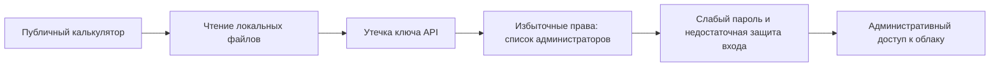

# Чтение файлов и границы доступа в облаке

Чтение произвольного файла становится особенно опасным, когда вспомогательный сервис хранит секреты с доступом к более важным системам.

## Цепочка риска

В кейсе Бастиона сервис принимал абсолютный путь, работал с высокими правами и раскрывал конфигурацию. Найденный ключ открывал привилегированные методы API. Ограничение попыток только по IP и отсутствие второго фактора не остановили дальнейший захват учётной записи. Это описанный авторами результат пентеста, а не воспроизведённый в Lab эксперимент.

## Проверяем разрыв цепочки — авторский план

Проводите проверки на изолированном стенде с безвредными файлами-маркерами и тестовыми учётными записями.

| Граница | Проверка | Ожидаемое доказательство |
| --- | --- | --- |
| Выгрузка отчёта | Разрешённый ID, неизвестный ID, файл другого пользователя | Только разрешённый отчёт; отказ не раскрывает путь и содержимое |
| Файловая система | Абсолютный путь, выход из каталога, ссылка за пределы каталога | Маркер вне разрешённой области не возвращается |
| Права процесса | Что может читать сервис при сбое проверки пути | Минимальные права и изоляция уменьшают доступную область |
| Межсервисный ключ | Вызов разрешённого и административного метода тестовым ключом | Отдельный ограниченный scope; запрет привилегированного вызова |
| Вход администратора | Повторные ошибки из разных тестовых источников | Защита учитывает учётную запись и риск; журнал фиксирует попытки |
| Восстановление | Отозвать тестовый секрет и проверить его повторно | Старый ключ перестаёт работать; новый имеет нужные ограничения |

Лучше выдавать отчёт по серверному идентификатору с проверкой владельца. Если пути необходимы, проверяйте итоговый разрешённый путь и ссылки, а не только запрещённые символы. Секрет-хранилище помогает управлять секретами, но не делает чрезмерно привилегированный процесс безопасным: доступ к секрету всё равно нужно ограничить.

Не приравнивайте чтение файла к выполнению кода. Для оценки последствий отдельно подтверждают, какие данные раскрываются и какие действия разрешает утёкшая учётная запись. Достаточность защиты входа проверяют по политике продукта, включая MFA и риск блокировки легитимного пользователя.

## Связанные материалы

- [Аутентификация и авторизация](authentication-authorization-review.md)

## Источник

- [bastion_pentest_team, Бастион: «Калькулятор с ключами: как чтение одного файла привело к компрометации публичного облака» (RU)](https://habr.com/ru/companies/bastion/articles/1083728/). Прочитан доступный текст; изображения отдельно не анализировались.
