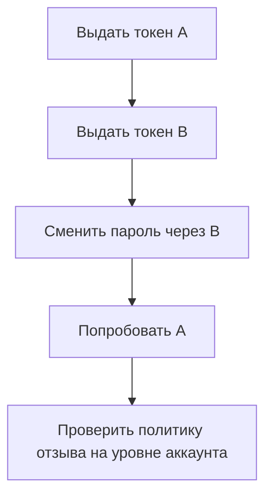

# Сброс пароля как автомат состояний

## Кратко

Статья описывает сценарий выдачи ссылок сброса A и B одной учётной записи. После смены пароля через B эта ссылка перестаёт работать, но A остаётся действительной. Каждый токен проходит изолированную проверку одноразовости, однако жизненный цикл восстановления на уровне аккаунта остаётся небезопасным. Это учебный сценарий, а не независимо подтверждённый инцидент.

## Последовательность теста

| Проверка | Ожидаемые свидетельства |
| --- | --- |
| A после выдачи B | Поведение соответствует документированной политике замены |
| A после успешного сброса через B | Нет непредусмотренного оставшегося пути восстановления |
| Повторное использование или истечение B | Отказ по правилам жизненного цикла |
| Существующие сессии | Отозваны или обработаны по согласованной политике |
| Параллельные попытки сброса | Согласованное конечное состояние без непредусмотренного повторного использования |

Проверка параллельных попыток — дополнительное QA-упражнение этой лаборатории.

## Стандарты и ограничения

OWASP рекомендует случайные, достаточно длинные, безопасно хранимые одноразовые токены со сроком действия, одинаковые ответы при проверке существования аккаунта, защиту от злоупотреблений, уведомление о сбросе и отзыв сессий либо возможность выбрать их отзыв. Шпаргалка не задаёт универсального правила, что выдача B немедленно отзывает A. Отзыв на уровне аккаунта после сброса — решение проектирования безопасности, которое нужно определить и проверить. [Рекомендации OWASP](https://cheatsheetseries.owasp.org/cheatsheets/Forgot_Password_Cheat_Sheet.html)

## Связанные темы и источник

- [Исследовательские эвристики](../manual-testing/exploratory-heuristics.md)
- [Проверка API](../../playbooks/checklists/api-request-review.md)
- [Статья о сбросе пароля](https://habr.com/ru/articles/1058180/). Прочитан полный кешированный текст, включая уточнение OWASP и рекламное окончание. Проверки живых аккаунтов не выполнялись.
