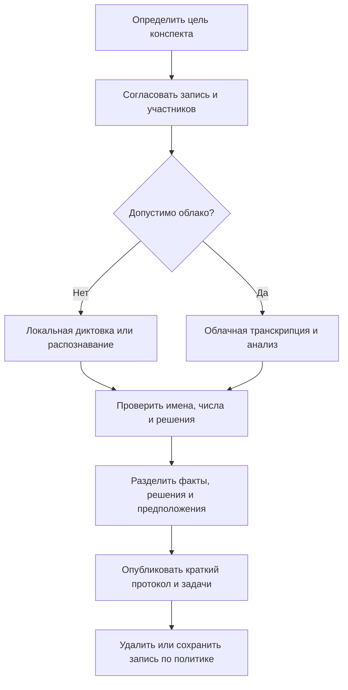

# Транскрипция встреч для QA: выбор инструмента и безопасный процесс

## Карта выбора

| Задача | Инструмент | Обработка и важное ограничение |
| --- | --- | --- |
| Диктовка прямо в Jira, Confluence или браузер | [Handy](https://handy.computer/) | Распознаёт на устройстве и вставляет текст в активное поле; нужны права на микрофон и ввод |
| Разовый анализ аудиофайла гибким промптом | [Google AI Studio](https://aistudio.google.com/) | Облачная мультимодальная модель; условия хранения и использования данных зависят от аккаунта и тарифа |
| Бот на встрече, транскрипт, саммари и вопросы | [HypeScribe](https://www.hypescribe.com/ru) | Облачный сервис; участие бота заметно другим участникам, действуют лимиты плана |
| Источник для вопросов, инструкций и онбординга | [NotebookLM](https://notebooklm.google.com/) | Облачный notebook с привязкой ответов к загруженным источникам; ошибки распознавания переходят в последующие ответы |
| Локальная расшифровка файлов на Mac | [MacWhisper](https://www.macwhisper.net/) | Есть локальные и облачные режимы; функции и модели различаются между бесплатной и платной версиями |
| Извлечение или перекодирование аудиодорожки в Windows | [Format Factory](https://www.softportal.com/software-9536-format-factory.html) | Это подготовка медиа, а не транскрипция; проверяйте происхождение установщика и параметры кодирования |

## Возможности и ограничения инструментов

### Handy

Официальная [документация Handy](https://handy.computer/docs) подтверждает Windows, macOS и Linux, горячую клавишу, локальные модели и вставку текста в активное поле. Приложение поддерживает Whisper и другие модели, поэтому формулировка «работает на базе Whisper» неполна. Согласно [privacy policy](https://handy.computer/privacy), обычное распознавание не отправляет аудио или текст разработчикам, но сеть используется для обновлений, загрузки моделей и добровольно подключённых сервисов. История и записи могут храниться локально; отдельного шифрования данных приложения нет. Утверждение «данные никуда не уходят» корректно только для обычного локального режима без внешней постобработки.

### Google AI Studio

[Gemini audio understanding](https://ai.google.dev/gemini-api/docs/audio) поддерживает анализ аудио, транскрипцию, таймкоды и ответы по содержимому. AI Studio подходит для экспериментов с промптами, но загружает файл в облачный сервис. Перед рабочей записью проверьте актуальные условия данных для типа аккаунта, региональные правила компании и допустимость стороннего AI. Саммари должно ссылаться на фрагменты или таймкоды, иначе решение легко исказить.

### HypeScribe

Страница продукта подтверждает Note Taker для Zoom, Teams и Google Meet, вопросы по материалу и ссылки YouTube, VK, Rutube и других платформ. По [текущей странице тарифов](https://www.hypescribe.com/pricing) бесплатная проба ограничена тремя файлами в месяц до часа каждый; Meeting Notetaker доступен не во всех планах. Сервис заявляет удаление исходного аудио после обработки, но транскрипты и данные аккаунта всё равно обрабатываются облачно. Маркетинговые заявления о скорости и точности не проверялись независимо.

### NotebookLM

Официальная [справка об источниках](https://support.google.com/gemininotebook/answer/16215270?hl=en) подтверждает импорт локальных аудиофайлов: при загрузке создаётся транскрипт, который сохраняется как источник; русский язык поддерживается. Поддержка видео или ссылки зависит от формата: например, YouTube требует доступных субтитров. Ответы с цитатами помогают проверке, но цитата ведёт к транскрипту, который сам может ошибаться.

### MacWhisper

Официальный сайт подтверждает бесплатную версию, локальные и облачные модели, работу с медиафайлами и встречами. [CLI-документация](https://docs.macwhisper.com/article/57-macwhisper-command-line-tool) подтверждает экспорт с таймкодами. Формулировка «без облака» верна при выборе локальной модели; дополнительные облачные модели и AI-функции могут передавать данные. Утверждение об отсутствии лимита размера именно в бесплатной версии не удалось подтвердить на просмотренных официальных страницах.

### Format Factory

Извлечение моно-аудио с подходящим битрейтом обычно уменьшает объём загрузки. Оно не сокращает продолжительность записи и не гарантирует более быстрое распознавание после загрузки. Слишком сильное сжатие может ухудшить речь. Ссылка источника ведёт на каталог SoftPortal, а не на проверенную страницу разработчика; перед установкой проверяйте издателя и цифровую подпись. Для повторяемого процесса подойдёт и FFmpeg из доверенного источника.

```text
ffmpeg -i meeting.mp4 -vn -ac 1 -ar 16000 -b:a 48k meeting-audio.m4a
```

## Безопасный процесс QA



1. До встречи назовите цель записи и получите необходимое согласие. Учитывайте договоры, локальное право и политику работодателя.
2. Не загружайте в личный облачный аккаунт исходный код, credentials, персональные данные, коммерческие условия или запись клиента без разрешения.
3. Храните оригинал до завершения проверки транскрипта и фиксируйте язык, участников, часовой пояс и дату.
4. Проверяйте имена, номера задач, версии, суммы, отрицания и фразы, из которых следует обязательство.
5. Отделяйте `решили`, `предложили`, `нужно уточнить` и `AI предположил`.
6. В Jira переносите одну проверенную задачу с владельцем и сроком, а не весь сырой транскрипт.

## Шаблон запроса к транскрипту

```text
На основе только этого транскрипта составь:
1. подтверждённые решения с таймкодами;
2. задачи: действие, владелец, срок; если данных нет — «не указан»;
3. открытые вопросы и противоречия;
4. риски для тестирования и затронутые компоненты;
5. термины и числа, которые нужно проверить по аудио.
Не добавляй решения или владельцев, которых нет в источнике.
```

## Чек-лист перед публикацией

- [ ] Участники знают о записи и цели обработки.
- [ ] Выбран допустимый локальный или облачный режим.
- [ ] Конфиденциальные данные разрешено загружать в выбранный сервис.
- [ ] Решения и задачи сверены с аудио или участниками.
- [ ] Для каждой задачи указаны действие, владелец и срок либо явно отмечен пробел.
- [ ] Сырые записи и транскрипты имеют владельца, срок хранения и правила удаления.

## Источники

- Исходная русскоязычная подборка с шестью ссылками, предоставленная пользователем 2026-09-21; автор и URL публикации неизвестны.
- [Handy](https://handy.computer/), [Google AI Studio](https://aistudio.google.com/), [HypeScribe](https://www.hypescribe.com/ru), [NotebookLM](https://notebooklm.google.com/), [MacWhisper](https://www.macwhisper.net/), [Format Factory на SoftPortal](https://www.softportal.com/software-9536-format-factory.html).
- [Планирование тестирования по рискам](../../qa/qa-process/test-planning.md).
- [Шаблон тест-плана](../../playbooks/templates/test-plan.md).
