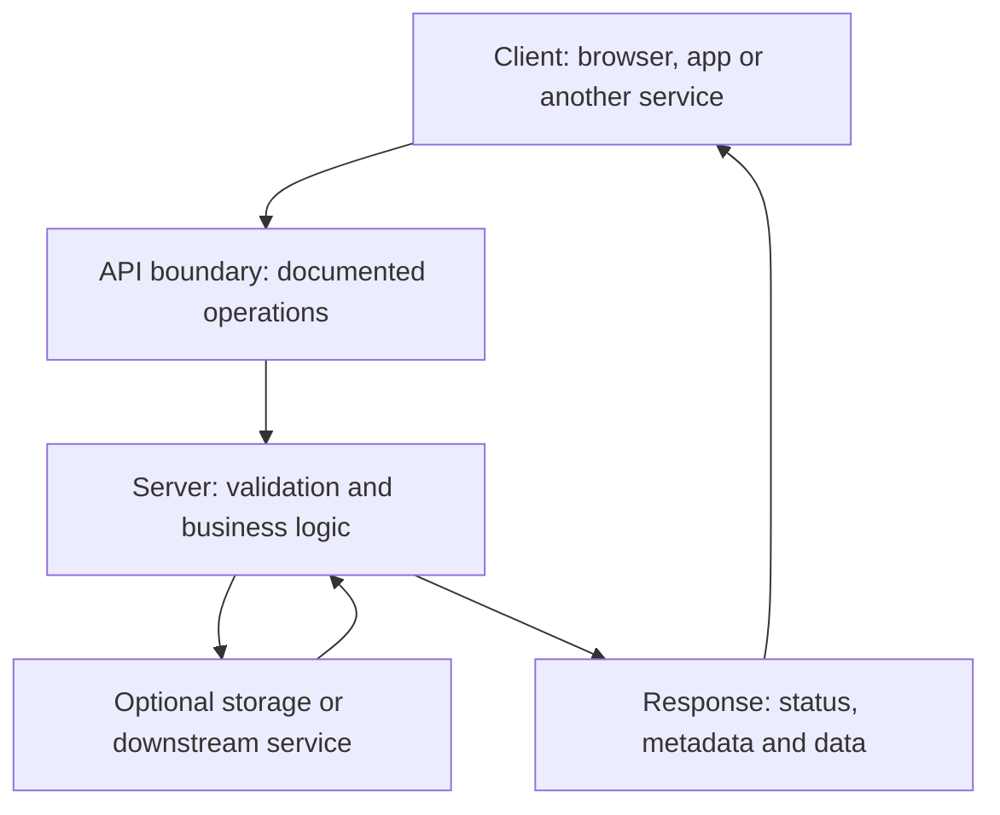

# API Foundations and HTTP Pitfalls

## Summary

Understand the contract, then test its observable behavior. Client/server roles explain who requests a service; HTTP defines exchange semantics; the application contract determines valid data and business outcomes.

This companion to [REST API Request Basics](rest-api-request-basics.md) adds architecture and a critical review of two QA4Life articles. The existing note remains the reference for methods, headers, status codes and JSON syntax.

## Source coverage

Both supplied article bodies were read, including interview questions and inline examples. Part 1 introduces client/server architecture, storage, DNS, HTTP/HTTPS/FTP and API contracts. Part 2 covers requests and responses, CRUD, methods, JSON/XML and status codes; its internal numbering also includes a “Part 3” section, which was read as part of that page. Embedded images and other parts of the series were not reviewed. Examples were not sent to a live service.

## Architecture in one view

| Concept | Practical interpretation |
| --- | --- |
| Client / server | Roles in an interaction; a client need not have a UI |
| API | An interface contract; not all APIs are remote or HTTP-based |
| Database | Optional dependency, not a condition of being a server |
| RAM / persistent storage | Data can exist in either; test the durability requirements |
| DNS | Resolves names; do not assume one domain corresponds to one server or one IP |
| HTTPS | Protects the connection with TLS; does not prove application correctness |

## HTTP corrections to remember

| Simplification in the source | More useful testing rule |
| --- | --- |
| POST cannot be cached | POST responses can be cacheable under defined conditions; check actual cache policy |
| POST bodies have virtually no limit | Servers, gateways and applications can impose body-size limits |
| PUT clears an omitted field to null | Replacement semantics do not prescribe that exact field outcome; use the contract |
| 403 proves authentication succeeded | It means refusal; authentication is not a universal prerequisite |
| 500 proves the request was valid | It describes unexpected server failure, not validated input |
| Every HTTP version uses a text start line | That presentation is HTTP/1.x; HTTP/2 uses frames and pseudo-headers |

These corrections follow [HTTP semantics](https://www.rfc-editor.org/rfc/rfc9110.html#section-9) and [HTTP/2](https://www.rfc-editor.org/rfc/rfc9113.html#section-8.3). HTTP methods are not direct database commands. A POST can include query parameters too.

## Security and data caveats

Use TLS terminology for modern HTTPS. A certificate helps authenticate the endpoint; it is not an endorsement of the site's honesty. Encryption does not hide all connection metadata or prevent endpoints from logging content. See [TLS 1.3](https://www.rfc-editor.org/rfc/rfc8446.html#section-1).

JSON and XML are representation formats, not competing transport protocols. REST does not require JSON. An XML empty element is not automatically equivalent to JSON null: mapping depends on the schema. Distinguish a missing field, null, an empty string and an empty collection.

## Practice — original contract exercise

For a fictional contact API, first specify supported media types, field requirements, update semantics and access rules. Then build this small evidence set:

| Scenario | Evidence to inspect |
| --- | --- |
| Create a contact | Documented success status and returned identifier |
| Read it back | Persisted values match the intended creation |
| Omit email during replacement | Contract-defined rejection, default or removal |
| Send unsupported media | Documented response and no unintended mutation |
| Retry a timed-out operation | Duplicate effects and retry policy |
| Trigger a server failure | Request, correlation ID and available server evidence |

Do not infer the responsible component solely from a status code. Capture the failure and investigate whether it originated in the application, gateway or another dependency.

## Sources and related knowledge

- [QA4Life / Евгений Гусинец — Part 1: Foundations](https://telegra.ph/SHpargalka-po-API-dlya-QA-CHast-1-Osnovy-07-07)
- [QA4Life / Евгений Гусинец — Part 2: HTTP and Data](https://telegra.ph/SHpargalka-po-API-dlya-QA-CHast-2-HTTP-i-dannye-07-07)
- [REST API Request Basics](rest-api-request-basics.md)
- [API request review checklist](../../playbooks/checklists/api-request-review.md)
