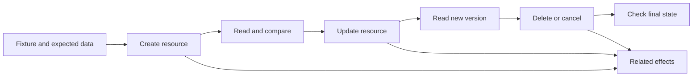

# API Testing: Responses, Access and State

API checks connect the contract, product rules and actual state after an operation. A successful HTTP status confirms only part of the outcome. Define initial data, expected response and permitted changes to related resources before testing.

## Resource lifecycle



## 20 checks in five groups

This matrix is a working adaptation for test design; your API contract defines concrete fields, codes and rules.

| Group | No. | Check | Evidence |
| --- | --- | --- | --- |
| Success | 1 | Status | Operation reached the claimed outcome |
| Success | 2 | Structure | Required and nested properties match the schema |
| Success | 3 | Types and formats | Numbers, dates and IDs use the specified representation |
| Success | 4 | Values | Response belongs to the current request and user |
| Success | 5 | Product rules | Independent fixture confirms the calculation |
| Input | 6 | Required properties | Missing required property rejected |
| Input | 7 | Empty and null | Missing, null and empty string handled by agreed rules |
| Input | 8 | Wrong type | Conversion or rejection matches the contract |
| Input | 9 | Boundaries | Limits and adjacent invalid values checked |
| Input | 10 | Extra properties | Unknown fields handled; protected fields unchanged |
| Error | 11 | Failure status | Protocol expresses the reason correctly |
| Error | 12 | Body | Structured message matches the failure |
| Error | 13 | Disclosure | Public response contains no secrets or implementation details |
| Access | 14 | Authentication | Missing and invalid credentials rejected |
| Access | 15 | Object | Second user cannot read or modify another user's resource |
| Access | 16 | Function | Role restricted for each method and operation |
| State | 17 | Persistence | Subsequent read confirms the change |
| State | 18 | Related effects | Reservation, event or other specified consequences checked |
| State | 19 | Repetition | Effect matches promised idempotency |
| State | 20 | Consistency | Related operations expose a permitted resource version |

## Learning example in Postman

A fictional library-bookmark API promises `201` and an object containing `id`, `title` and `owner_id`. A test fixture defines the expected title and owner in advance. Add this script to the creation request's Post-response section:

```javascript
pm.test("Bookmark creation matches the fixture", () => {
  pm.response.to.have.status(201);
  const bookmark = pm.response.json();
  pm.expect(bookmark.id).to.be.a("string").and.not.empty;
  pm.expect(bookmark.title).to.eql(pm.collectionVariables.get("expected_title"));
  pm.expect(String(bookmark.owner_id)).to.eql(pm.collectionVariables.get("expected_owner_id"));
  pm.collectionVariables.set("bookmark_id", bookmark.id);
});
```

The next request, `GET /bookmarks/{{bookmark_id}}`, independently verifies persisted values. For a forbidden update, use user B, then read the object as owner A: a failure response alone does not prove that nothing was written. The example was not executed against a real service.

## Making assertions useful

- Do not calculate an expected price solely from prices in the response: consistently wrong values can pass. Use an independent fixture and product formula.
- Check structured error codes and fields instead of searching for a word anywhere in JSON. A substring can appear in an irrelevant location.
- Reject extra properties only for a closed contract; declaring `properties` does not make fields required.
- Idempotency concerns effects: repeated DELETE can return a different code. POST duplicate protection needs a separate agreement.
- For asynchronous work, define a deadline and permitted states; polling must end with diagnostics rather than indefinitely masking failure.

## Extending and automating the suite

Select by risk: pagination and stable ordering, limits and quota recovery, older clients, concurrent-update conflicts, dependency failures, feature-flag states, asynchronous completion, event signatures and duplicates, caching and user isolation.

Give the collection its own data, unique request names, environment variables and cleanup after failure. Save IDs after confirmed creation and never reuse a stale ID following failure. Establish expected behavior before automating it. The basic 20 checks do not replace load, integration or specialized security testing.

## Related materials

- [API foundations and HTTP pitfalls](api-foundations-and-http-pitfalls.md)
- [HTTP status codes](http-status-codes.md)
- [API toolkit and test strategy](../../tools/developer-tools/api-testing-toolkit.md)

## Sources

- [Netology: «Как тестировать API: 20 проверок, которые должен уметь делать QA» (RU)](https://habr.com/ru/companies/netologyru/articles/1075684/)
- [RFC 9110: HTTP Semantics (EN)](https://www.rfc-editor.org/rfc/rfc9110.html)
- [JSON Schema: object (EN)](https://json-schema.org/understanding-json-schema/reference/object)
- [OWASP: Broken Object Level Authorization (EN)](https://api-security.owasp.org/editions/2023/en/0xa1-broken-object-level-authorization/)
