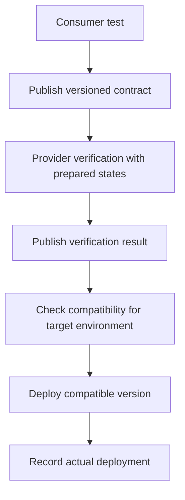

# Consumer-Driven Contracts with Pact

## Summary

Pact checks whether a provider satisfies the interactions its consumers depend on. Consumer tests exercise client code against a mock; provider verification checks those interactions against the provider. This reduces undetected drift between mocks and services, but does not establish complete business correctness.

## Release workflow

The official Pact documentation explains that the compatibility matrix needs application versions, verification results and accurate deployment records. Missing verification is uncertainty, not a passing result. Pending contracts support development without immediately breaking the provider build; deployment compatibility still needs checking.

## Practical QA review

| Check | Example |
| --- | --- |
| Real consumer behavior | Exercise the production API client, not a duplicate test client |
| Meaningful matchers | A string matcher alone does not constrain an allowed status enum |
| Repeatable provider state | Seed and clean an isolated order for each interaction |
| Failure coverage | Include missing-resource and validation responses actually consumed |
| Remaining integration risk | Retain checks for authentication, transport and end-to-end behavior |

## Limitations and corrections

The article's consumer state name differs from the later provider handler unless the intermediate parameterized replacement is applied. Its examples are instructional fragments, not a validated runnable project. A generated OpenAPI document can also diverge from runtime behavior; generation alone is not proof. Consumer contracts can benefit known public-API clients but cannot cover unknown consumers. Product pricing, rebranding and migration-speed claims were not independently verified.

## Related topics and sources

- [API request basics](rest-api-request-basics.md)
- [Domain test-data DSL](../automation/domain-test-data-dsl.md)
- [Pact article](https://habr.com/ru/articles/1058382/). Complete cached body read; examples not executed.
- [Official Pact deployment compatibility documentation](https://docs.pact.io/pact_broker/can_i_deploy), checked September 6, 2026.
