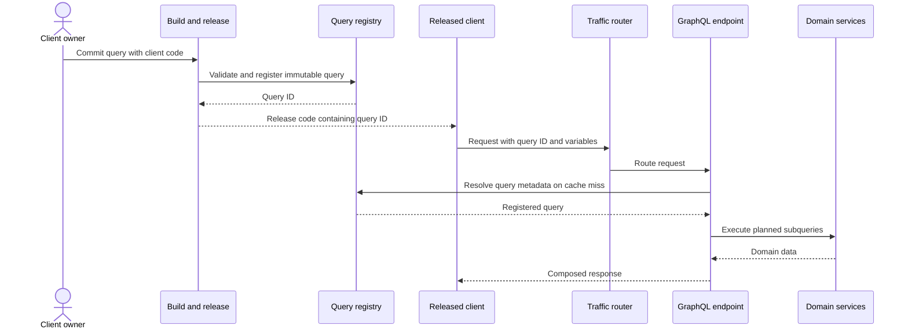

# Registered GraphQL Queries at Scale

The supplied ByteByteGo diagram redraws a LinkedIn architecture in which client queries are tested and registered during delivery, then production clients send immutable query identifiers. The execution endpoint resolves the identifier, caches metadata and dispatches subqueries to domain services. This is a production control pattern, not a requirement of GraphQL itself.

## Build-time control plane

Client owners author queries beside client code. CI validates them against the schema, assigns or receives a stable identifier and publishes the query to a central registry before releasing the client. Registration creates an allowlist of known operations and makes query ownership, compatibility and usage visible.

The release dependency matters: a client must not ship before its query is available, and removing a registered query must account for old clients. Test the pipeline with schema incompatibility, duplicate registration, partial publication, rollback and concurrent client versions.

## Runtime data plane

The released client sends a query ID plus variables rather than arbitrary query text. A traffic-routing layer sends the request to the appropriate frontend API server. Its GraphQL endpoint resolves the ID from cache or registry, executes the prepared plan across domain services and composes the result.

Pre-registration can reduce parsing and planning work, support caching and limit the production operation set. It does not automatically solve expensive valid queries, field authorization, N+1 access, downstream fan-out, stale cache entries or sensitive-data exposure.

## QA strategy

Test three contracts together:

1. **Schema contract:** fields, nullability, types, deprecation and authorization remain compatible with supported clients.
2. **Registry contract:** the ID resolves to the intended immutable document, publication is ordered before client release, and cache invalidation behaves predictably.
3. **Execution contract:** variables, partial errors, timeouts, fan-out, batching, tracing and response assembly preserve the product behaviour.

Useful negative cases include unknown or retired IDs, a valid ID with invalid variables, a client built against a newer schema, inaccessible fields, a registry outage with warm and cold caches, one failing domain service and a query whose cost exceeds policy. Observe query ID, client version, latency by resolver, downstream calls and error classification without logging secrets.

## Boundaries of the pattern

Standard GraphQL commonly accepts query documents at runtime, and persisted-query mechanisms vary. A central registry adds deployment coupling and operational infrastructure. It is valuable where a controlled client fleet, high request volume, query governance or predictable execution justify that cost. Public exploratory APIs may need a different balance.

The diagram simplifies federation and execution. LinkedIn's published architecture describes distributed GraphQL endpoints in frontend microservices and schemas generated from existing entity systems; do not infer that every request passes through one universal GraphQL server.

## Sources

- User-supplied ByteByteGo redraw of the LinkedIn GraphQL flow, reviewed on 2026-09-26.
- [LinkedIn Engineering: How LinkedIn adopted a GraphQL architecture](https://www.linkedin.com/blog/engineering/architecture/how-linkedin-adopted-a-graphql-architecture-for-product-developm)
- [GraphQL specification](https://spec.graphql.org/)

