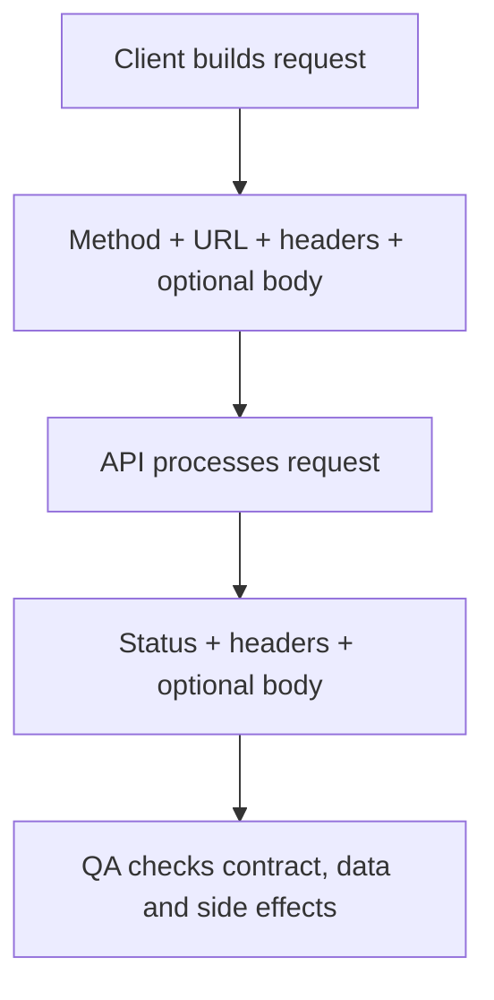

# REST API Request Basics

## TL;DR

Read an API exchange as a request plus a response. Test the documented behavior, returned data, permissions, and side effects together. A successful status alone does not prove correctness.

## What it is

An introductory HTTP reference for QA, processed from three user-supplied Russian cheat-sheet images. The concepts apply to HTTP APIs generally; using HTTP and JSON alone does not establish that an API follows REST architectural constraints.

## Why QA should care

This is the vocabulary needed to investigate failures in an API client, browser network panel, or automated test report.

## How it works



### URL anatomy

Example contract, not a live endpoint:

```text
https://api.example.com/contacts/2?fields=phone,email
│       │               │        │
Scheme  Host            Path     Query
```

The full path is `/contacts/2`; `2` is a parameter value when the API defines a route such as `/contacts/{id}`. Query conventions such as `fields=phone,email` are API-specific. Neither `?phone` nor `?phone&email` universally selects response fields: consult the contract.

### HTTP methods

| Method | Intent |
| --- | --- |
| GET | Retrieve a representation |
| POST | Process submitted content; often creates a resource |
| PUT | Create or replace target state |
| PATCH | Apply partial modifications |
| DELETE | Remove the target association; physical data erasure is not guaranteed |

GET is safe; GET, PUT, and DELETE are idempotent by defined semantics. Idempotency concerns intended effect, not identical responses. POST and PATCH are not inherently idempotent. PATCH behavior depends on its document format. [HTTP methods](https://www.rfc-editor.org/rfc/rfc9110.html#section-9), [PATCH](https://www.rfc-editor.org/rfc/rfc5789.html)

### Headers

| Header | Meaning |
| --- | --- |
| Accept | Preferred response media types |
| Content-Type | Content media type |
| Accept-Encoding / Content-Encoding | Accepted / applied content codings, such as gzip |
| Authorization | Authentication credentials |
| Content-Length | Length in bytes, not characters |
| Location | Status-dependent resource reference |

`Accept-Charset` is deprecated. [HTTP semantics](https://www.rfc-editor.org/rfc/rfc9110.html)

### Response status quick reference

| Code | Meaning |
| --- | --- |
| 200 / 201 | Success / created |
| 202 | Accepted; completion is not guaranteed |
| 204 | Success without content |
| 301 | Permanent redirect |
| 401 | Missing valid authentication credentials |
| 403 | Request refused |
| 404 | Not found or existence undisclosed |
| 405 | Method unsupported for this resource |
| 409 | Conflict with current resource state |
| 500 | Unexpected server condition |
| 502 / 504 | Gateway received invalid upstream response / timed out |
| 503 | Temporarily unavailable |

[Status definitions](https://www.rfc-editor.org/rfc/rfc9110.html#section-15)

### JSON essentials

JSON supports objects, arrays, strings, numbers, booleans, and null. Arrays can contain any JSON values, not just objects. Use straight double quotes; comments and trailing commas are invalid. A property fragment needs enclosing braces to form an object. `5` and `"5"` have different types. [JSON specification](https://www.rfc-editor.org/rfc/rfc8259.html)

```json
{
  "pets": [
    { "name": "Spot", "type": "dog", "age": 5 },
    { "name": "Fluffy", "type": "cat", "age": 3 }
  ]
}
```

## When to use it

Use this reference when reading an unfamiliar endpoint contract, creating a first API test, or explaining a failed request to a teammate.

## Example

For a hypothetical `GET /contacts/{id}?fields=phone,email` contract:

1. Request a contact owned by the test user.
2. Check the documented status, response schema, and expected contact values.
3. Verify that field selection behaves as documented.
4. Repeat with another user's contact ID and verify the access rule.
5. Try missing, malformed, and unknown IDs; compare each outcome with the contract.

These are proposed QA checks, not claims about a real service. See the [companion checklist](../../playbooks/checklists/api-request-review.md).

## Common mistakes

- Treating HTTP methods as direct database commands.
- Assuming a query parameter has meaning without checking the API contract.
- Accepting a test solely because it returned 200.
- Treating a numeric string as a JSON number.
- Retrying a state-changing request without understanding duplicate effects.

## Limitations

This is an entry-level reference, not a complete HTTP or REST guide. Authentication, caching, cookies, pagination, and concurrency deserve separate notes. No example request was sent to a live API.

## Source review

The supplied images credit **The Thinking Tester, 2018**, and a Russian translation by **software-testing.ru**. Their exact original article URL and reuse license were not supplied. Attribution is transcribed from the images, not independently verified. The images were used as intake material; this note is an English synthesis with original examples, rather than a reproduction of their layout.

Corrections: database-centric method definitions were replaced; query examples are explicitly contract-dependent; 401 and 403 are distinguished; JSON examples use valid quotes and complete objects; array values are not restricted to objects. Less essential legacy headers were omitted from this introductory reference.

## Related topics

- [API request review checklist](../../playbooks/checklists/api-request-review.md)
- [API testing index](README.md)

## Sources

- User-supplied three-page REST API cheat sheet, received 2026-09-05; image attribution described above.
- [RFC 9110 — HTTP Semantics](https://www.rfc-editor.org/rfc/rfc9110.html)
- [RFC 5789 — PATCH Method](https://www.rfc-editor.org/rfc/rfc5789.html)
- [RFC 8259 — JSON](https://www.rfc-editor.org/rfc/rfc8259.html)
