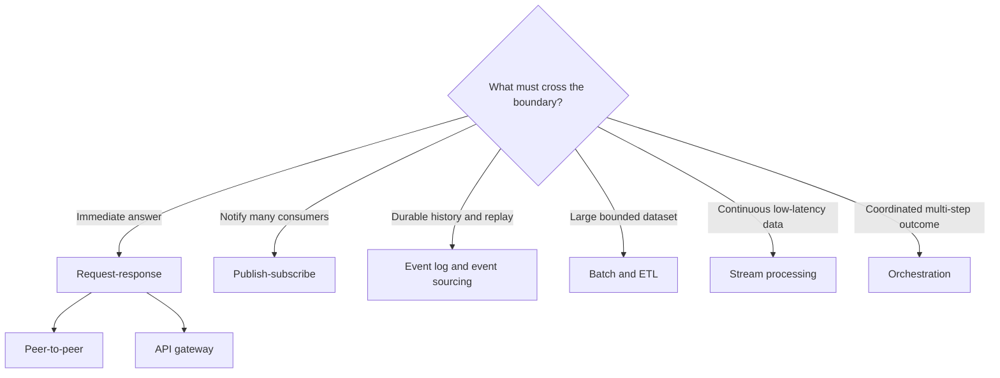

# Nine System Integration Patterns and Their Test Boundaries

The nine patterns in the supplied ByteByteGo visual are useful lenses, but they are not nine interchangeable solutions at one architectural level. Some describe service communication, some data processing, one state persistence, and one workflow control. A real system often combines several of them.

## Synchronous service communication

**Peer-to-peer** calls are direct and can be simple at small scale, but a dense call graph increases coupling, cascading-failure risk and ownership ambiguity. Test contracts, timeouts, retries, idempotency and partial failure rather than only the happy response.

**Request-response** describes the interaction shape: a caller waits for a correlated result. HTTP is common but not required. Verify status and schema together with latency, cancellation, duplicate requests, downstream timeout and whether a retry is safe.

**API gateway** provides one controlled entry point for routing, authentication, rate limits, protocol adaptation or aggregation. It does not remove failures in downstream services. Test gateway policy separately from service behaviour: identity propagation, routing, transformations, limits, caching, observability and degraded dependencies.

## Messaging and durable event history

**Publish-subscribe** decouples publishers from subscribers through a topic or broker. Each subscriber normally receives relevant messages independently. Verify delivery semantics, duplicate handling, ordering scope, poison-message policy, schema evolution, backpressure and eventual consistency.

**Event sourcing** stores state changes as an append-only event history and derives current state by replay or projections. It is more than publishing events. Test invariants at command acceptance, event version compatibility, deterministic replay, projection rebuild, snapshots and correction of invalid history.

## Data movement and computation

**ETL** extracts data, transforms it and loads a destination. It can run in batches or streams. Verify source-to-target reconciliation, field mapping, nulls, rejected records, late data, restartability, lineage and whether a rerun duplicates output.

**Batch processing** works on a bounded collection on a schedule or size trigger. It favours throughput and repeatability over immediate results. Test cutoff boundaries, partitioning, checkpoints, reruns, partial completion and total reconciliation.

**Stream processing** continuously handles an unbounded event flow. Test event time versus processing time, windows, watermarks, late and out-of-order events, backpressure, partition rebalancing, state recovery and exactly-once claims at the business outcome rather than only the broker.

## Workflow coordination

**Orchestration** gives a coordinator responsibility for a multi-step workflow. It makes sequence and status visible but concentrates control. Test transitions, retries, timeouts, compensation, manual intervention, idempotent activities and recovery after the orchestrator restarts. Choreography through events is an alternative when participants can react independently; it trades central control for a harder global view.

## Selection and test matrix

| Need | Likely starting pattern | Evidence QA needs |
|---|---|---|
| Simple immediate query | Request-response / direct API | Contract, latency, timeout and error mapping |
| One public surface for services | API gateway | Policy, routing, auth propagation and downstream degradation |
| Fan-out notification | Publish-subscribe | Delivery, duplicates, ordering and consumer lag |
| Auditable state reconstruction | Event sourcing | Invariants, replay, schema evolution and projection rebuild |
| Periodic high-volume conversion | Batch ETL | Reconciliation, rerun safety and checkpoints |
| Continuous near-real-time computation | Stream processing | Windows, late data, backpressure and recovery |
| Long-running business transaction | Orchestration | State transitions, compensation and operator recovery |

Choose from required latency, coupling, replay, volume, consistency, failure ownership and operational skill. Combining patterns is normal: an API gateway may start an orchestrated workflow that publishes events and feeds a streaming projection.

## Sources

- User-supplied ByteByteGo “Top 9 System Integrations” infographic, reviewed on 2026-09-26.
- [Microsoft: integration architecture design](https://learn.microsoft.com/en-us/azure/architecture/integration/integration-start-here)
- [Microsoft: event-driven architecture](https://learn.microsoft.com/en-us/azure/architecture/guide/architecture-styles/event-driven)
- [Microsoft: API gateways in microservices](https://learn.microsoft.com/en-us/azure/architecture/microservices/design/gateway)
