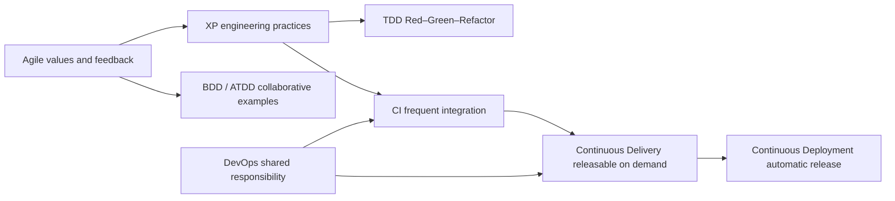

# Agile, DevOps and TDD: A Reviewed Quality Strategy

## How the practices relate

Scrum is a lightweight framework for complex work and intentionally leaves engineering tactics open. XP, TDD, BDD and CI/CD can complement it. QA participates in a cross-functional team instead of acting as an isolated final gate.

## Corrections that matter

| Source claim | Reviewed interpretation |
| --- | --- |
| CI means 5–10 integrations or 10+ builds daily | CI means frequent mainline integration with fast automated feedback; cadence is contextual |
| Build success must exceed 95% and fixes take under 30 minutes | Possible internal SLOs. Add baselines, failure causes, recovery time and flaky rate |
| Delivery is manual and Deployment means “the robot decides” | Delivery is the capability to release safely on demand; Deployment automatically releases qualifying changes. Policies and approvals can remain upstream |
| TDD produces >90% coverage and fewer defects | TDD defines a development loop. Coverage and defects are separate outcomes |
| Pyramid means 60% unit, 30% BDD, 10% E2E | It is a heuristic favoring many fast narrow checks and fewer broad expensive ones. BDD is not a test level |
| ATDD cuts rework to 0–5% | It can expose disagreement earlier, but outcomes depend on participation and examples |
| Q1, Q2 and Q4 are automated while Q3 is manual | Quadrants discuss purpose; manual and automated work may occur in any quadrant |
| 80% automation and zero defects are maturity norms | Derive targets from risk and feedback cost. “No known critical defects” can be a release criterion, not proof of no defects |

## Operational QA strategy

1. Identify risks and concrete behavior examples during refinement. Use Given/When/Then when it clarifies a rule.
2. Keep fast unit/component checks near code, integration/contract checks at boundaries, and E2E checks for critical journeys.
3. Run fast deterministic checks on every CI change. Place slower suites later while preserving a clear failure signal.
4. Stop promotion on agreed criteria such as a critical defect, broken contract/security control, or unacceptable instability. QA supplies evidence; risk acceptance has an owner.
5. Track change lead time, failure causes, recovery time, escaped defects and flaky rate. Use coverage to locate untested code, not as a quality score.
6. Revise checks using production evidence, architecture changes and maintenance cost.

## Review checkpoint

- Explain CI, Continuous Delivery and Continuous Deployment without naming a tool.
- Choose test levels by speed, defect localization and risk instead of copying a fixed ratio.
- Show which uncertainty TDD, BDD and ATDD reduce and who joins each feedback loop.
- Give every numeric target an owner, measurement window, baseline and response.
