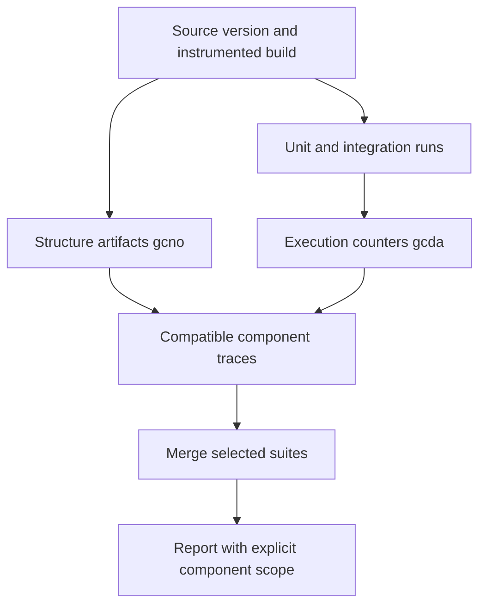

# Collecting and Merging Code Coverage

In the case study, a separate instrumented build produces `.gcno`, while test devices return `.gcda`. Independent test pipelines produce per-package traces; a separate pipeline merges them and creates reports for selected component sets.

## Artifact flow

## Pipeline checks: Lab template

| Check | Acceptance condition |
| --- | --- |
| Compatibility | Sources, build, architecture and tool correspond |
| Provenance | Each artifact belongs to a specific run |
| Completeness | Expected component set known, not only discovered files |
| Missing data | No test, collection failure and zero execution distinguished |
| Merging | Compatible data merged rather than averaging percentages |
| Isolation | Old counters excluded from a new run |
| Comparison | Trends interpretable when code scope changes |

## Report selection and limitations

Separate critical-component, base-set and full-product views; define each denominator. High coverage of a small selected set must not be presented as coverage of the whole system.

Instrumentation changes execution conditions: measure release-build performance separately. Coverage shows code execution, not assertion quality. Behavior checks and sensitivity to defects remain necessary.

For Lab, this is an architectural reference, not an implemented C/C++ coverage process. Case-study commands were not run. The authors' proposed migration to gcovr is a plan, not a completed result.

## Sources

- [Ivan Rastegaev: «Особенности сбора кодового покрытия в ОС „Нейтрино“» (RU)](https://habr.com/ru/companies/swd_es/articles/1080274/)
