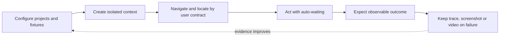

# Playwright TypeScript Practical Cheat Sheet

Playwright Test combines a test runner, isolated browser contexts, resilient locators, auto-waiting assertions, network control and failure artifacts. This reference keeps the useful breadth of the supplied cheat sheet while correcting patterns that commonly create races or flaky tests.



## Install, run and debug

```bash
npm init playwright@latest
npx playwright test
npx playwright test tests/checkout.spec.ts
npx playwright test --grep @smoke
npx playwright test --project=chromium
npx playwright test --ui
npx playwright test tests/checkout.spec.ts:18 --debug
npx playwright show-report
```

`npm init playwright@latest` scaffolds a Playwright Test project. Install browser binaries after dependency installation; Linux CI may use `npx playwright install --with-deps`. Pin dependency versions through the lockfile instead of treating commands in an infographic as timeless.

## Test anatomy and configuration

```ts
import { test, expect } from '@playwright/test';

test('customer can add a product', { tag: '@smoke' }, async ({ page }) => {
  await page.goto('/products');
  await page.getByRole('button', { name: 'Add to cart' }).click();
  await expect(page.getByRole('status')).toHaveText('Added to cart');
});
```

Put runner controls such as `testDir`, `retries`, `workers`, `projects` and `reporter` at the top level of `playwright.config.ts`. Put browser-context options such as `baseURL`, `viewport`, `locale`, `storageState`, `trace`, `screenshot` and `video` under `use`. Enable `forbidOnly` in CI so an accidental `test.only` cannot silently reduce coverage.

## Locators, actions and assertions

Prefer locators that describe the user contract: `getByRole`, `getByLabel`, `getByText`, `getByPlaceholder`, `getByAltText`, `getByTitle`, then a deliberate `getByTestId`. Narrow with `filter`, `and`, `or`, `first`, `last` or `nth` only when the resulting target remains unambiguous. Long CSS and XPath chains couple tests to implementation.

Actions such as `click`, `fill`, `check`, `selectOption`, `press`, `hover` and `dragTo` perform actionability checks. Web-first assertions re-resolve the locator until the condition passes or times out:

```ts
const save = page.getByRole('button', { name: 'Save' });
await expect(save).toBeEnabled();
await save.click();
await expect(page.getByRole('status')).toContainText('Saved');
await expect(page).toHaveURL(/\/profile$/);
```

Avoid `waitForTimeout` as synchronization. Prefer a visible product outcome, an auto-retrying assertion, `waitForResponse`, `waitForURL`, `waitForLoadState` when that state is truly relevant, or `expect.poll` for an eventually consistent condition. `locator.all()` does not wait for a dynamic list to finish loading.

## Isolation, authentication and multiple users

Each test gets an isolated `BrowserContext` through the built-in fixtures. Reuse authenticated `storageState` only when accounts and server-side data are safe for parallel tests. A second user in one scenario needs a second context:

```ts
const adminContext = await browser.newContext({ storageState: 'playwright/.auth/admin.json' });
const customerContext = await browser.newContext({ storageState: 'playwright/.auth/customer.json' });
const adminPage = await adminContext.newPage();
const customerPage = await customerContext.newPage();
// ... interaction between two roles ...
await Promise.all([adminContext.close(), customerContext.close()]);
```

Never commit live credentials or production session state. API setup can make UI tests faster, while critical authentication behaviour still needs focused end-to-end coverage.

## Events, files, dialogs and frames

Subscribe to an event before triggering it, then await both parts in order:

```ts
const downloadPromise = page.waitForEvent('download');
await page.getByRole('button', { name: 'Export' }).click();
const download = await downloadPromise;
await download.saveAs(`test-results/${download.suggestedFilename()}`);

page.once('dialog', dialog => dialog.accept());
await page.getByRole('button', { name: 'Delete' }).click();

await page.getByLabel('Upload file').setInputFiles('fixtures/report.csv');
await page.frameLocator('#payment-frame').getByLabel('Card number').fill('4242424242424242');
```

Popups use the same promise-before-action pattern with `page.waitForEvent('popup')`. Downloaded temporary files disappear when their context closes unless explicitly saved.

## API, network and browser state

The built-in `request` fixture is useful for preconditions and API assertions. Requests through `page.request` or `context.request` share cookie storage with the browser context; an isolated `apiRequest.newContext()` does not unless configured. Use `page.route` or `browserContext.route` to observe, stub, modify or abort requests, but keep at least some tests against real integrations.

Cookies, local storage and session storage are separate mechanisms. `storageState` covers cookies and local storage; session storage requires explicit handling. A `requestfailed` event means the network request failed, not that the server returned HTTP 404 or 500.

## Diagnostics, projects and annotations

Use projects for browsers, devices or environment variants. Keep traces on the first retry or on failure to balance evidence and storage. Playwright Test tracing includes assertion information that low-level `context.tracing` does not capture.

Use `test.skip` for an inapplicable case, `test.fixme` for a known test or product problem that prevents execution, `test.fail` when failure is currently expected but execution remains useful, and `test.slow` only for an intentionally longer timeout. Tags select suites; annotations preserve context in reports. Retries expose instability but do not repair a flaky test.

## Sources

- User-supplied Playwright cheat-sheet image, reviewed on 2026-09-26.
- [Playwright locators](https://playwright.dev/docs/locators)
- [Playwright assertions](https://playwright.dev/docs/test-assertions)
- [Playwright configuration](https://playwright.dev/docs/test-configuration)
- [Playwright API testing](https://playwright.dev/docs/api-testing)
- [Playwright trace viewer](https://playwright.dev/docs/trace-viewer)

