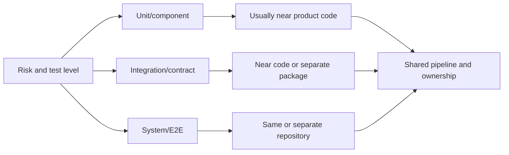

# Python for QA: Reviewed Lessons 1–2

## TL;DR

Lesson one introduces the Python environment, Git, VS Code, basic types and collections, and compares keeping automated tests separately with colocating test code and the application. Lesson two continues with `venv`, functions, arguments, classes and a learning model: `Tester → TestCase → Step → Bug`.

Both pages were read in full, including commands, tables, examples, homework and links. The supplied diagram confirms the two organization models, but they are not mutually exclusive architectures: one product often combines multiple test levels and repository shapes.

## Material map

| Area | Keep | Clarify |
| --- | --- | --- |
| Test architecture | Test code must follow product changes | Repository, language, environment and test level are independent decisions |
| Environment | Use a project environment and controlled dependencies | Activation is convenient; invoking the chosen interpreter directly is also valid |
| Types and collections | `list`, `dict`, `tuple`, `set`, strings and slices | `dict` preserves insertion order; `str` is an immutable sequence |
| Functions | Explicit parameters, `*args`, `**kwargs`, safe defaults | The full grammar also includes positional-only and keyword-only parameters |
| Classes | Objects combine state and behavior | `__init__` initializes an existing instance; `self` is a convention, not a keyword |
| OOP | Encapsulation, inheritance and polymorphism help discuss design | “Three pillars” is a teaching model; underscores do not create strict access levels |

## Organizing automation



Choose structure from ownership, change frequency, access boundaries, reuse, pipeline time and delivery. A monorepo does not guarantee developer participation, and a separate repository does not imply weak business alignment. Shared libraries can speed development, but reusing production logic in the oracle can reproduce the same defect in test and product.

## Reliable project start

```bash
python -m venv .venv
# Windows PowerShell
.venv\Scripts\Activate.ps1
python -m pip install --upgrade pip
python -m pip install pytest requests
python -m pytest
```

Do not commit `.venv`. Store direct dependencies and constraints in `pyproject.toml` or the selected project format, and use a lock file or controlled build procedure for reproducibility. `pip freeze` is useful as an environment snapshot, but without curation it also records transitive and platform-specific packages.

## Main corrections

| Source claim | Reviewed clarification |
| --- | --- |
| Python executes every line through four sequential conversion steps | CPython usually compiles a module to bytecode executed by its virtual machine; the compiled/interpreted boundary is blurry |
| Compiled languages are always fastest, bytecode is medium and interpreted languages are slow | Performance depends on implementation, JIT/AOT, workload, libraries and measurement; this table cannot drive a technical choice |
| C is “static weak,” while Python and JavaScript are simply “dynamic” | Static/dynamic typing and the informal strong/weak scale are different axes; casts and memory access do not create a rigorous classification |
| Python type errors appear only at runtime | Type hints and static analyzers find many mismatches before execution, although the runtime does not enforce hints by default |
| `dict` is unordered | Insertion order has been a Python language guarantee since 3.7 |
| `str` is a primitive, not a collection | Python values are objects; `str` is an immutable sequence type |
| A `venv` stores complete private copies of Python | It has its own interpreter link/copy and `site-packages`, but can rely on the base installation and standard library |
| `__init__` is the constructor | `__new__` creates the instance; `__init__` initializes it |
| `_protected` and `__private` define access levels | One underscore is an internal-API convention; double leading underscores trigger name mangling to avoid accidental clashes, not secrecy |
| Jupyter is unsuitable for automation | Notebooks help exploration and diagnostics; reproducible automated checks are better stored as modules and run in CI |
| Collection-use percentages and one “most popular” stack are universal | These are unmeasured practitioner observations, not stable ecosystem statistics |

## Corrected learning model

The source defines `Tester.write_bug_report(self, scenario, failed_step)` but constructs `Bug` without its required `actual_result`; the example then calls the method with both `actual_result` and `severity`. It raises `TypeError`. A consistent minimal version is:

```python
from dataclasses import dataclass, field

@dataclass
class Step:
    number: int
    description: str
    expected_result: str

@dataclass
class TestCase:
    name: str
    steps: list[Step] = field(default_factory=list)
    status: str = "not_run"

@dataclass
class Bug:
    scenario: TestCase
    failed_step: Step
    actual_result: str
    severity: str = "major"

    def __post_init__(self):
        index = self.scenario.steps.index(self.failed_step)
        self.steps_to_reproduce = self.scenario.steps[: index + 1]

class Tester:
    def __init__(self, name: str, level: str):
        self.name = name
        self.level = level
        self.test_cases: list[TestCase] = []

    def create_test_case(self, name: str, steps: list[Step] | None = None):
        case = TestCase(name, [] if steps is None else list(steps))
        self.test_cases.append(case)
        return case

    def write_bug_report(self, scenario, failed_step, actual_result, severity="major"):
        return Bug(scenario, failed_step, actual_result, severity)
```

Test more than object construction: an unknown step should produce a clear error, severity should be validated, step numbers should be unambiguous, and mutating the input list after case creation should not silently modify the scenario.

## Practical checklist

- [ ] The Python version follows project and dependency support, rather than a number copied from a tutorial.
- [ ] The project interpreter and environment are explicit in the editor and CI.
- [ ] `.venv`, secrets and temporary files are excluded from Git.
- [ ] Dependencies are installed through `python -m pip` into the intended environment.
- [ ] A test asserts an observable outcome instead of only performing actions.
- [ ] Shared application logic is not the test's only oracle.
- [ ] Mutable values are not used as parameter defaults.
- [ ] Composition is preferred when there is no true “is-a” relationship.
- [ ] Models validate domain-relevant states and errors.
- [ ] Test architecture accounts for parallelism and data isolation.

## Sources and connections

- [“Lesson 1: Introduction to Python and Test Automation Basics”](https://qa4life.yonote.ru/share/eb4ebed0-58de-45df-b8ce-3d19fa91dd10), Russian, read 2026-09-22.
- [“Lesson 2: Functions, Classes and Object-Oriented Programming Principles”](https://qa4life.yonote.ru/share/07652a76-5384-459f-a06a-dea6d5c1a392), Russian, read 2026-09-22.
- [Python classes and name mangling](https://docs.python.org/3/tutorial/classes.html), [Python glossary](https://docs.python.org/3/glossary.html), and [venv](https://docs.python.org/3/library/venv.html).
- [marimo documentation](https://docs.marimo.io/) and [Python environments in VS Code](https://code.visualstudio.com/docs/python/environments).

Connections: [Playwright Python](playwright-python-basics.md), [atomic test composition](atomic-test-composition.md), and [test planning](../qa-process/test-planning.md).
