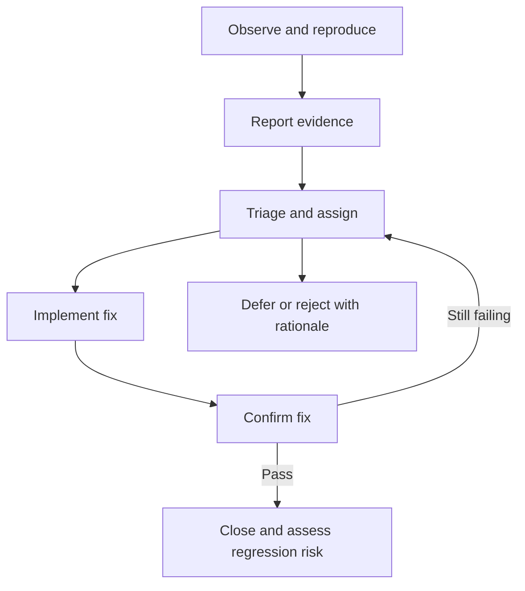

# Testing Concepts

## TL;DR

Separate where you test, what you evaluate, why you run a check, and how it is executed. These are different dimensions, not competing labels.

## Quick reference

| Dimension | Examples | QA question |
| --- | --- | --- |
| Level | Component, component integration, system, system integration, acceptance | Which boundary is under test? |
| Quality focus | Functional behavior, performance, usability, security | Which risk are we evaluating? |
| Change-related purpose | Confirmation, regression | Did the fix work, and did it cause side effects? |
| Execution | Human-led, automated, mixed | Which activities benefit from tools or human judgment? |

The five-level terminology follows [ISTQB CTFL v4.0.1, section 2.2](https://istqb.org/wp-content/uploads/2024/11/ISTQB_CTFL_Syllabus_v4.0.1.pdf). Exhaustive testing is generally impossible; select coverage by risk. Early feedback helps reduce rework, but is not a guarantee about every defect's cost. The supplied PDF's short principles list is not the official complete ISTQB principles list.

## Practical use

For a checkout change, a component test can check rounding, an integration test can check a payment boundary, and acceptance testing can assess business readiness. A smoke suite gives quick evidence about essential flows; it does not establish full release confidence. Manual testing may still use tools.

## Defect workflow example

Statuses vary by team. Acceptance testing is not restricted to end users personally executing every check.

## Choosing checks for a change

One test can belong to several dimensions: an automated system-level regression test may check a security requirement. A classification is a planning aid, not proof that every risk is covered.

| Change | Starting evidence | Expand according to risk |
| --- | --- | --- |
| Defect fix | Confirm the original failure no longer occurs | Add cases for the fix and regression around affected behavior |
| New integration | Interface and failure-handling checks | Cross-system journeys, data consistency and recovery |
| UI text edit | Text, wrapping and relevant locales | Accessibility and shared-component impact |
| Urgent production fix | Targeted confirmation and critical-flow checks | Relevant regression, monitoring and rollback readiness |

This is an original planning matrix, not a mandatory release recipe. Scope depends on impact, likelihood, available evidence and constraints; neither “full regression every release” nor “smoke only in production” is universally sufficient.

## Terms that need care

- **System versus E2E:** system is a test level; a complete journey may cross system boundaries. They are not synonyms.
- **Acceptance versus UAT:** acceptance includes operational, contractual and regulatory forms as well as UAT; it need not wait for a final project phase.
- **Confirmation versus regression:** confirmation can include new tests for changes made by the fix, not just rerunning the original failed steps. Regression checks for adverse consequences elsewhere. See [CTFL section 2.2](https://istqb.org/wp-content/uploads/2024/11/ISTQB_CTFL_Syllabus_v4.0.1.pdf).
- **Smoke versus sanity:** document the team's intended scope rather than assuming every team uses these labels identically. No universal test count or duration applies.
- **Positive versus negative:** valid scenarios extend beyond one happy path. Negative testing examines appropriate handling of invalid inputs or exceptional conditions; an error message may be the correct outcome.
- **Types versus techniques:** boundary value analysis and equivalence partitioning derive tests; they are not interchangeable with levels or quality attributes.

## QA4Life source review

The article organizes testing by levels, purpose, scenarios and quality concerns, then proposes change-based selection with loyalty, email and payment examples. Its practical value is prompting risk questions. Its numeric loads, response-time targets and anecdotal incident are source examples, not independently verified benchmarks or universal requirements.

Additional corrections: object-access denial need not always return 403; assert the documented access rule and absence of data leakage. UI appearance and usability are different concerns. Accessibility is broader than one contrast number. For normal-size text, WCAG's cited technique addresses a minimum contrast of 4.5:1; assess other text sizes and components against their applicable criteria, not that number alone. See [W3C contrast technique G18](https://www.w3.org/WAI/WCAG22/Techniques/general/G18.html).

Coverage: all seven text sections read on 2026-09-12. No application scenarios executed or source incident independently reproduced.

- [QA4Life / Евгений Гусинец — Testing types cheat sheet](https://telegra.ph/Vidy-i-tipy-testirovaniya--shpargalka-QA-07-03-2)

## Related topics and earlier sources

- [Software quality and measurable criteria](software-quality-criteria.md)

- [Risk-based test planning](../qa-process/test-planning.md)
- [Exploratory heuristics](../manual-testing/exploratory-heuristics.md)
- Source: `cheatlistbase.pdf`, pp. 1-2; [batch provenance and corrections](../../docs/sources/2026-09-05-testing-cheat-sheets.md).
