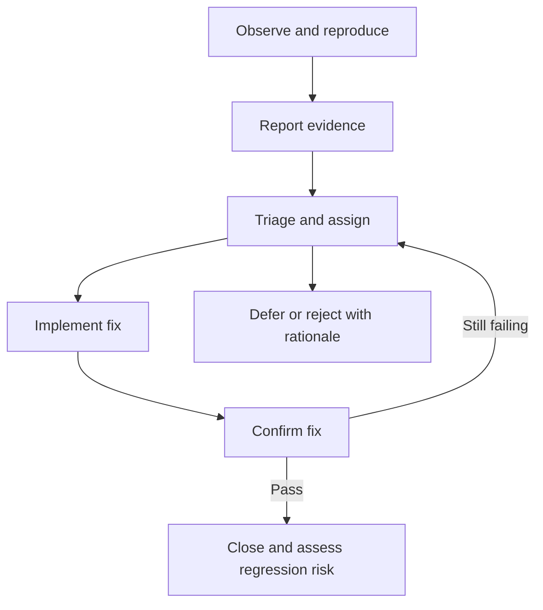

# Testing Concepts

## TL;DR

Separate where you test, what you evaluate, why you run a check, and how it is executed. These are different dimensions, not competing labels.

## Quick reference

| Dimension | Examples | QA question |
| --- | --- | --- |
| Level | Component, component integration, system, system integration, acceptance | Which boundary is under test? |
| Quality focus | Functional behavior, performance, usability, security | Which risk are we evaluating? |
| Change-related purpose | Confirmation, regression | Did the fix work, and did it cause side effects? |
| Execution | Human-led, automated, mixed | Which activities benefit from tools or human judgment? |

The five-level terminology follows [ISTQB CTFL v4.0.1, section 2.2](https://istqb.org/wp-content/uploads/2024/11/ISTQB_CTFL_Syllabus_v4.0.1.pdf). Exhaustive testing is generally impossible; select coverage by risk. Early feedback helps reduce rework, but is not a guarantee about every defect's cost. The supplied PDF's short principles list is not the official complete ISTQB principles list.

## Practical use

For a checkout change, a component test can check rounding, an integration test can check a payment boundary, and acceptance testing can assess business readiness. A smoke suite gives quick evidence about essential flows; it does not establish full release confidence. Manual testing may still use tools.

## Defect workflow example

Statuses vary by team. Acceptance testing is not restricted to end users personally executing every check.

## Related topics and sources

- [Risk-based test planning](../qa-process/test-planning.md)
- [Exploratory heuristics](../manual-testing/exploratory-heuristics.md)
- Source: `cheatlistbase.pdf`, pp. 1-2; [batch provenance and corrections](../../docs/sources/2026-09-05-testing-cheat-sheets.md).
