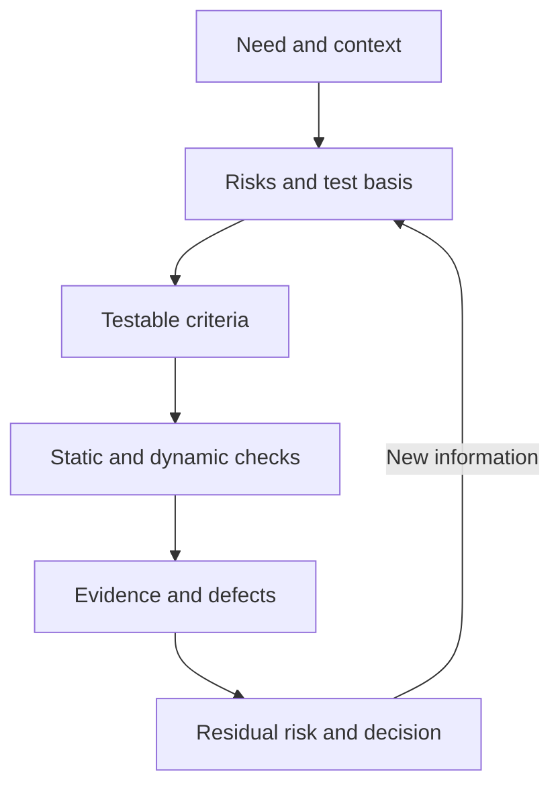

# Testing Foundations: Blocks 1–3

## Working model

1. Identify the object, stakeholders and risk to reduce.
2. Find the test basis: requirements, design, code, agreements, regulations or observed behavior.
3. Record a testable expected result and the conditions under which it applies.
4. Select static and dynamic checks, a test level and relevant quality characteristics.
5. Collect evidence: environment, data, steps, actual result, logs and impact.
6. Communicate residual risk and the decision owner; test or bug counts alone do not establish quality.

## Terms worth separating

| Pair | Practical distinction |
| --- | --- |
| Error / defect / failure | A human action may introduce a defect; execution of the defective item under particular conditions may cause an observable failure |
| Expected / actual result | Expected behavior is derived from the test basis and agreed criteria; a discrepancy requires investigation rather than automatic defect classification |
| Severity / priority | Severity describes impact; priority describes work order and urgency. Scales and decision owners depend on the team |
| Verification / validation | Simplified: conformance to specification and fitness for a need; real activities may provide both kinds of evidence |
| Positive / negative check | Valid scenarios confirm expected behavior; invalid and exceptional conditions check safe, understandable handling |
| Static / dynamic testing | Static testing evaluates work products without executing the software under test; dynamic testing requires its execution |

## Positive and negative testing (§1.3)

The page's strength is its concrete examples for email, password, age, file upload, authorization, search, numeric input and API tokens. The main idea is best stated this way: a positive check uses conditions expected to be valid, while a negative check uses invalid, exceptional or boundary conditions and verifies controlled system behavior. Both tests pass when the actual result matches the expected result. Therefore, *Test to Pass* and *Test to Fail* do not mean that a negative test should crash the product or receive a Failed result.

Practical corrections to the page:

- There is no universal 70/30 or 50/50 ratio between positive and negative tests. The set follows risk, the contract, criticality and available time.
- Equivalence partitioning and boundary value analysis apply to valid and invalid partitions or boundaries; they are not exclusively negative techniques.
- A happy path is usually a positive scenario, but positive testing is broader than one happy path. A smoke suite is defined by critical functions and may contain negative checks.
- “Both types for every condition” is a useful heuristic rather than a mandatory rule. Each condition needs checks that provide enough coverage of its associated risk.
- HTTP codes depend on the contract: 401 usually concerns missing or invalid authentication, 403 insufficient authorization, and 400 a malformed request. Derive the expectation from the API specification.
- SQL injection and XSS are also security testing. Perform such checks only in an authorized environment and within an agreed scope.

## Seven testing principles (§1.6)

The list largely matches ISTQB CTFL 4.0.1: testing shows the presence of defects; exhaustive testing is impossible; early testing saves time and money; defects cluster together; tests wear out; testing is context dependent; and absence of defects alone does not guarantee a useful product.

Clarifications for the wording and examples:

- In CTFL 4.0.1 the fifth principle is named Tests wear out. “Pesticide paradox” is a common earlier label for the idea, but it is not the current syllabus heading.
- Repeated regression tests do not automatically become useless: they still confirm the behavior they cover, but become less effective at finding new classes of defects. Review and extend the suite and data.
- “100–1000 times cheaper” and “80% of defects in 20% of modules” illustrate a direction and a heuristic, not universal guarantees.
- Early testing includes static and dynamic activities as early as practicable; it is broader than having a tester present from day one.
- The absence-of-defects principle concerns meeting user needs and business goals even after conforming to a specification. “Validation matters as much as verification” is a useful reminder, while real activities often provide both kinds of evidence.

## Practical principles

- Early feedback is useful, but these multipliers are not a universal law. Cost depends on the product, architecture, detection and consequences
- Defect clustering describes observed concentration; 80/20 is a heuristic. Do not treat the percentages as guaranteed
- This model appears in learning materials, but titles and boundaries vary. ISTQB describes test roles and activities, not a mandatory QA/QC corporate hierarchy
- This is the author's career guide. SQL, API and Git are useful, while a particular language, broker, Kubernetes or AI depends on the vacancy and product context
- A local scale. Agree definitions, examples, authority and triage SLA within the organization
- Always state denominator, period, scope, severity and data source. A high percentage does not prove acceptable risk
- This is the 2011 model. The current [ISO/IEC 25010:2023](https://www.iso.org/standard/78176.html) has nine characteristics; the complete paid standard was not reviewed here
- This is a convenient model, but constraints can apply at every level, and a quality characteristic often qualifies how a function is delivered
- These terms come from different practices and models. Before applying one, define its meaning, owner and the decision the artifact supports

## Testware, criteria and reviews

Plans, strategies, test bases, scenarios, test cases, logs and reports form testware in an organization's particular context. Each document does not need a separate artifact. Keep the minimum set that supports planning, execution, reproducibility and decisions.

Entry, exit, suspension and resumption criteria answer different questions: when useful testing can start, when enough has been completed, when to stop and what allows work to resume. Definition of Done is a team agreement about completion of a work item; it does not automatically replace testing exit criteria or a release decision.

Reviewing requirements, code and tests can reveal ambiguity and defects before software execution. Formality depends on risk. An inspection requires defined roles and a process; a walkthrough and technical review do not have to copy that structure. See the official [ISTQB CTFL v4.0.1](https://istqb.org/wp-content/uploads/2024/11/ISTQB_CTFL_Syllabus_v4.0.1.pdf).

## Practical checklist

- [ ] The check names the risk or question it should answer.
- [ ] Test basis, environment, data and build version are recorded.
- [ ] The expected result is testable and does not rely on “fast,” “friendly” or “normal” without a criterion.
- [ ] Positive, negative and exceptional scenarios are selected by risk.
- [ ] Severity is distinct from priority, and the release decision from the number of closed test cases.
- [ ] A metric has a period, denominator, scope and purpose.
- [ ] Requirements and tests are linked where traceability helps assess impact and coverage.
- [ ] The result communicates known residual risk and evidence limitations.

## Sources

- [Testing concepts](testing-concepts.md).
- [Software quality and measurable criteria](software-quality-criteria.md).
- [Risk-based test planning](../qa-process/test-planning.md).
- [Source PDF — “Основы тестирования Блок 1–3”](../../docs/sources/originals/2026-09-21-testing-foundations-blocks-1-3.pdf), SHA-256 `4ac1d19608900339f00e4784c862d0a6a9bd7e929b402c0ec64059f7a5faf3ba`.
- [Updated Block 1 PDF](../../docs/sources/originals/2026-09-21-testing-foundations-block-1-new.pdf), SHA-256 `857b5400a12f2b281a6e05fcb4346b5a0175dbd25fd749aa2c91aa183ff34081`.
- Attached pages: [seven principles](../../docs/sources/originals/2026-09-21-testing-foundations-block-1-update/seven-testing-principles.png), SHA-256 `dfa8bf6e2f0fb01c0b884222372f004fe1f1bac0d5544b15ccaf55d5af482854`; [positive and negative testing](../../docs/sources/originals/2026-09-21-testing-foundations-block-1-update/positive-vs-negative-testing.png), SHA-256 `da7d6aa8bc93140261154b1b662a52dadc32ec4cf1f9fb8d67d948138799b543`.
- [ISTQB CTFL v4.0.1](https://istqb.org/wp-content/uploads/2024/11/ISTQB_CTFL_Syllabus_v4.0.1.pdf) and the public [ISO/IEC 25010:2023](https://www.iso.org/standard/78176.html) page, checked 2026-09-21.
