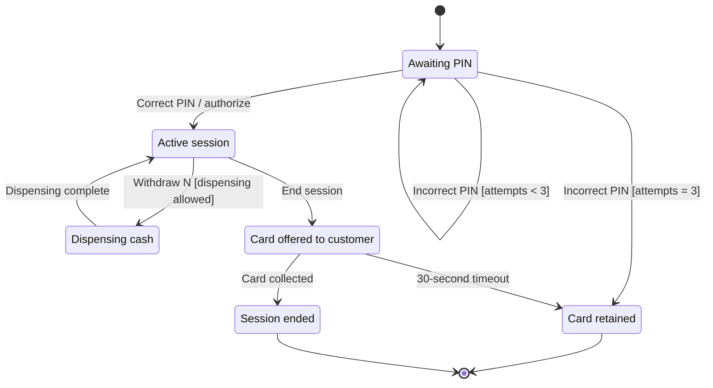

# State Transition Testing

A state determines which events the system currently accepts. A transition identifies the starting state, event, guard, action and next state. Test event order as well as individual outcomes.

## Teaching ATM model

Here the card is returned when the session ends; dispensing returns to operation selection. The 30-second timeout and retention after three incorrect PINs are example assumptions, not universal banking rules. PIN entry is modeled as an event rather than a separate state.

## Event contract

| State | Event / condition | Expected outcome |
| --- | --- | --- |
| Session | Withdraw N; amount allowed | One dispensing operation |
| Session | N = 10,000; available cash = 5,000 | Rejection; session retained, no debit |
| Dispensing | Repeated command | No second dispensing; current operation continues |
| Dispensing | Completion | Return to operation selection |
| Card offered | Customer collects card | End session |
| Card offered | Timeout expires | Retention and event record |

The dispensing guard should cover a positive permitted amount, balance, limits, suitable banknotes and device readiness. Total cassette value is insufficient: available denominations may not form the requested amount. Define rejection behavior and resulting state in the contract when a guard is false.

## Checks

- Reach every state and exercise valid exits, including repeated operations.
- Check incorrect PINs and attempt-counter reset according to new-session rules.
- Test before, at and after the timeout boundary; separately test the card-collection/timer race. Specify event ordering.
- Repeat the command during dispensing and verify no additional cash or debit.
- Simulate device failure, lost response and restart. Specify reconciliation and recovery; the diagram above excludes these failure branches.

Double-clicks and retries after lost responses are different cases. Define the API operation identifier or idempotency key, result retention and behavior for the same key with another amount. Test sequential and concurrent repeats of one key; a new key may identify another operation. POST itself does not provide idempotency.

## Choosing coverage

State coverage visits every state; 0-switch exercises every valid transition. Test invalid transitions separately: visiting a state does not cover them.

1-switch covers valid consecutive transition pairs; n-switch covers sequences of n+1 transitions. For example: session → dispensing → session. Choose depth by the risk of ordering failures, rather than a fixed rule of singles for regression and pairs for new code.

## Sources

- Supplied QA❤️4LIFE cheat sheet: «Тестирование состояний и переходов»; unchanged image saved in the [archive](../../docs/sources/originals/state-transition-cheat-sheet.png).
- [ISTQB CTFL v4.0.1, §4.2.4 (EN)](https://istqb.org/wp-content/uploads/2024/11/ISTQB_CTFL_Syllabus_v4.0.1.pdf)
- [ISTQB CTAL-TA v4.0, §3.2.2: N-switch (EN)](https://istqb.org/wp-content/uploads/sdm-uploads/ISTQB-CTAL-TA-Syllabus-v4.0-EN-4.pdf)

The supplied sheet also cites Lee Copeland, A Practitioner's Guide to Software Test Design. That chapter was not independently checked; coverage definitions were verified against the linked syllabuses.
