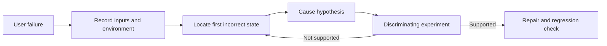

# Systematic Debugging: From Failure to Verified Cause

An observed failure starts an investigation. Hypothesize the first incorrect internal state, choose a discriminating experiment, then change the implementation.

## Choosing observations

| Conditions | Next step |
| --- | --- |
| Reproducible | Reduce inputs and trace value changes |
| Artifacts only | Correlate chronology, dump and exact build |
| Schedule dependent | Observe threads and synchronization; control ordering |
| Environment dependent | Compare configuration, ABI, dependencies and data |
| QA only | Reproduce together before rewriting code |

The defect → infection → failure chain distinguishes a defect, incorrect internal state and visible failure. The article's padding-hashing example explains why logically equal keys must not acquire different hashes from their memory representation.

## Hypothesis record — working template

1. Fact: which outcome differs from requirements? Identify the run.
2. Hypothesis: which condition might cause the first divergence?
3. Prediction: what should change when one input is controlled?
4. Experiment: authorized environment, observation and falsification criterion.
5. Outcome: facts, excluded explanations and next check, separate from assumptions.

QA Lab example: a table overflows only at a particular zoom. Record viewport, zoom and measured boundaries; test the same page and data at another scale. If overflow disappears, this narrows explanations without proving a particular CSS cause.

For races, breakpoints can change scheduling. Reproduction after an artificial delay supports but does not prove a hypothesis. A futex wait does not establish deadlock without dependency analysis. A container does not reproduce another OS kernel; use a suitable VM or real system for those differences. Verify the original failure and neighboring scenarios after repair; one passing run is insufficient.

## Sources

- [Кирилл Кайданов: Системная отладка или Как искать баги: при чем тут дедукция и цепочка Целлера (RU)](https://habr.com/ru/companies/garda/articles/1083046/)

Details presented only in embedded source images were not separately transcribed; the note uses the accessible text and authored working templates.
