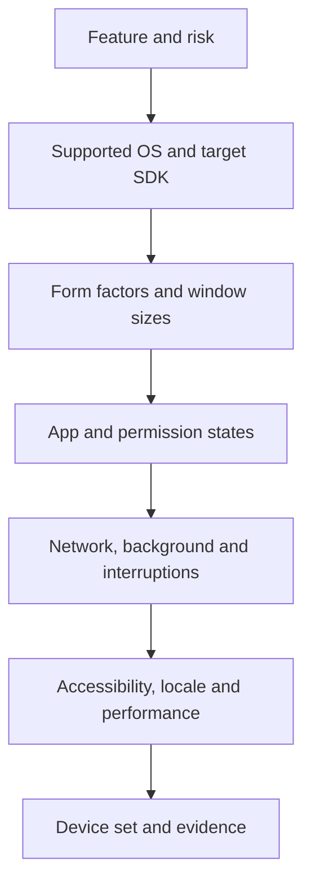

# Mobile Testing: Reviewed Guide

## TL;DR

The source is a large practical map of mobile testing: devices and platforms, 17 testing areas, 20 checklist groups, Charles Proxy, Android/iOS tools, common defects and a reference section. Use it as an idea generator rather than executing every item for every release. Build the matrix from user analytics, change risk, supported operating systems, form factors and device capabilities.

The complete publicly accessible page text was read: 53,284 characters covering all seven sections, tables, commands and glossary. The author is Evgeniy Gusinets and the channel is QA❤️4Life. The page does not state a publication date or license. The review was authored in Russian first, then translated into English.

## Source map

| Section | Subject | Application |
| --- | --- | --- |
| 1 | Devices, app types, OS versions, design guidance and hardware | Select real configurations from product analytics and support requirements |
| 2 | Functionality, UI/UX, compatibility, network, interruptions, performance, accessibility, security and background behavior | Form risk areas and expected behavior |
| 3 | Detailed checklists from environment setup to deep links, payments and platform modes | Adapt them to the feature; do not copy numeric thresholds without requirements |
| 4 | Charles setup, throttling, rewrite, TLS, redirects, concurrency, cache and uploads | Use only in an authorized test environment with test data |
| 5 | Physical devices, emulators, Android Studio, Xcode, profilers and device clouds | Combine fast virtual coverage with evidence from real devices |
| 6 | Leaks, orientation, network, WebView, push and synchronization | Convert common failures into risk-based scenarios |
| 7 | Boundaries, HTTP, displays, ADB, shortcuts, test plan and glossary | Verify against the product contract and current platform documentation |

## Coverage matrix

For every significant scenario, record the app and backend versions, device or emulator profile, OS/API level, installation state, account, permissions, network, locale, theme and power-saving mode. This makes defects reproducible and helps distinguish application failures from environmental ones.

## Main corrections

| Source claim or rule | Clarification |
| --- | --- |
| iOS 16–18 and Android API 33–35 are current in 2026 | The list is stale. Android 16 is API 36, and Google Play requires API 36 for new apps and updates from August 31, 2026. Derive iOS coverage from the product's current support matrix and analytics |
| React Native and Flutter are hybrid apps | They are commonly described as cross-platform native frameworks; hybrid usually refers to web content in a native container. WebView and native-rendering risks differ |
| Test the latest 2–3 OS versions plus the most popular one | This is a starting heuristic. Include the minimum supported version, user share, target SDK, crash-heavy models and relevant platform changes |
| Uninstall guarantees a clean reinstall | Keychain, cloud backups, server state and some identifiers may remain. Test local, cloud and server state separately |
| App Clips have a 10 MB limit | Limits have changed and depend on OS version and invocation type; use Apple's current requirements for the release |
| Installing the Charles CA is enough for any Android app | Apps targeting Android 7+ do not trust user CAs by default. Use a safe debug trust configuration; pinning and individual networking libraries may still block interception |
| Certificate pinning is a universal mandatory defense | Android warns about pinning risks and recommends a backup key. Security and architecture owners need a rotation and recovery plan |
| Cold start <3 s, tap delay <100 ms, API <2–3 s and 60 FPS are universal | These may be targets, but require a product SLO, device class, network, start state, percentile and measurement method |
| All text requires 4.5:1 contrast | 4.5:1 applies to normal text; large text may use 3:1, while UI components and graphics have separate WCAG criteria |
| An HTTP method or status always has one expected behavior | The API contract defines status codes, idempotency and response bodies. A repeated DELETE may validly return 204, 404 or another documented response |
| Repeat POST 5–10 times and expect exactly one record | This applies only when the contract guarantees idempotency, for example through an idempotency key. Multiple resources may otherwise be correct |
| SQL/XSS/path-traversal strings are ordinary input data | These are security probes. Use them only in an authorized environment and scope without risking data damage |
| Every regression must run on physical devices | Use a mixed strategy. Emulators scale quickly; physical devices matter for sensors, OEM behavior, energy, radio conditions and actual performance |

## Practical minimum set

1. Select devices by user share and risk: at least one current iOS configuration, one minimum-supported configuration, several Android API/OEM combinations and relevant form factors.
2. Test clean install, upgrade from a supported previous version and state restoration.
3. Exercise the critical path on a normal network, then during loss, latency, switching and recovery.
4. Test permission grant, denial, limited access, revocation and return from Settings.
5. Test foreground, background, terminated state, interruptions, deep links and push in supported states.
6. Increase system text size and enable a screen reader, dark theme, RTL/long locale and hardware keyboard when in scope.
7. Measure startup, responsiveness, memory, CPU, network and energy on a defined device class with a repeatable scenario.
8. Before release, repeat the critical path on physical devices and record residual risk.

## Charles and network checks

An interception proxy helps observe requests, throttle connections and substitute controlled responses. Never ship trust for a test CA in a production build. On Android, use a debug-only Network Security Configuration; on iOS, account for ATS, pinning and networking-library behavior.

Inspect more than status: method, URL, headers, body, authentication, retry, timeout, caching, redirects, personal data and side effects. Load conclusions from 50–100 Charles requests are limited; server-side capacity needs a dedicated tool and controlled load profile.

## Evidence checklist

- [ ] The device matrix follows support, analytics and risk.
- [ ] Build, backend, OS/API, model and installation state are recorded.
- [ ] Permissions cover grant, deny, limited, revoke and Settings.
- [ ] State survives rotation, resize, backgrounding, process death and memory pressure when required.
- [ ] Offline/retry/sync avoids duplicates and cross-account data leaks.
- [ ] Accessibility is checked with platform services, not only visually.
- [ ] Performance thresholds state conditions and requirement source.
- [ ] MITM and injection probes run only in an authorized environment.
- [ ] Known omissions and residual risk appear in the report.

## Sources and related material

- [Evgeniy Gusinets — “Шпаргалка-гайд по мобильному тестированию”](https://qa4life.yonote.ru/share/410ee537-b9b4-4c37-87f8-6856defec0b1), read 2026-09-22.
- [Android API levels](https://developer.android.com/guide/topics/manifest/uses-sdk-element), [Google Play target API requirements](https://developer.android.com/google/play/requirements/target-sdk), [Network Security Configuration](https://developer.android.com/privacy-and-security/security-config) and [minimize permission requests](https://developer.android.com/privacy-and-security/minimize-permission-requests), checked 2026-09-22.
- [Web UI testing](../../playbooks/checklists/web-ui-testing.md).
- [REST API request basics](../api-testing/rest-api-request-basics.md).
- [Risk-based test planning](../qa-process/test-planning.md).
