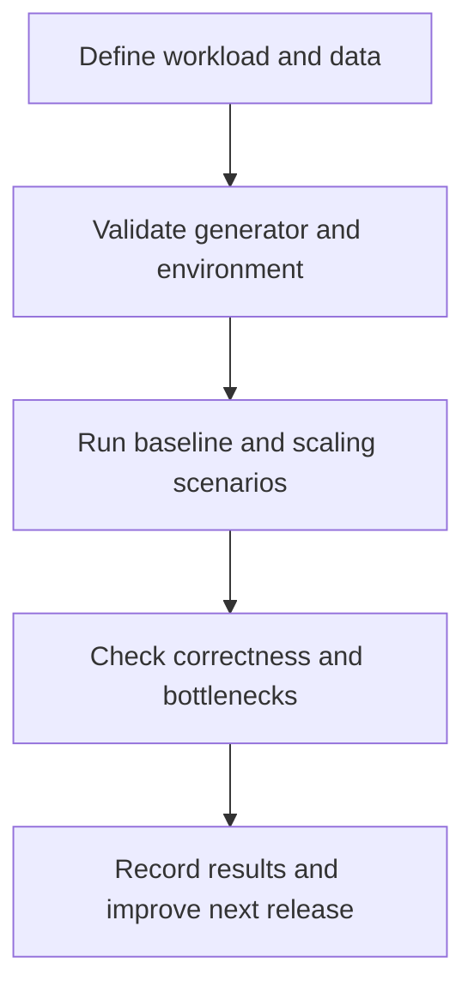

# Repeatable Load Testing

## TL;DR

Make performance testing a repeatable release activity with realistic data, a documented workload, and correctness checks alongside throughput.

## Source summary

LDM engineers describe a recurring test programme for their content-management platform. They use Gatling against a dedicated Kubernetes environment, preload documents and access policies, test operations separately, then assess scaling and sustained load. Their checks include subsequent reads: a successful upload response does not establish that a file can be downloaded correctly.

Reported bottlenecks include database saturation, a shared network interface limiting load generation, and memory fragmentation. Reports feed changes into later releases. Mixed workloads and real application requests require additional coverage beyond isolated operations. These are the team's reported observations, not independently reproduced benchmarks. [Case study](https://habr.com/ru/articles/1061680/)

## Key concepts and QA relevance

| Concept | QA question |
| --- | --- |
| Data scale | Does the test dataset represent production size and distribution? |
| Load profile | Which operations, users, arrival rates and pauses are represented? |
| Generator capacity | Is the client or shared network limiting the measurement? |
| Correctness under load | Can completed writes be read back accurately? |
| Scalability | Which dependency prevents extra instances improving throughput? |
| Repeatability | Are version, configuration and workload changes recorded? |

## Practical example

For a document API, define an agreed latency and error budget, preload representative documents, and run upload plus read-back checks. Record response-time percentiles, errors, successful business operations, and infrastructure saturation. Repeat with a mixed profile before extrapolating to a customer workload. This is a proposed exercise, not a benchmark from the article.

## Limitations and critical reading

The article's broad scalability language coexists with a database bottleneck. Preserve that boundary. A database bottleneck remains relevant to the delivered system regardless of which team operates it. Tool comparisons, licensing statements and capacity figures are version- and setup-dependent; this note does not recommend a purchase or repeat them as universal facts. Embedded benchmark charts were not separately transcribed or audited; the complete article body was read.

## Related topics and sources

- [API request review](../../playbooks/checklists/api-request-review.md)
- [Test planning](../qa-process/test-planning.md)
- Vladimir Semenov and Olesya Pankova, [LDM load-testing case study](https://habr.com/ru/articles/1061680/), supplied through the July 2026 digest. Company-authored primary account of its own work.
