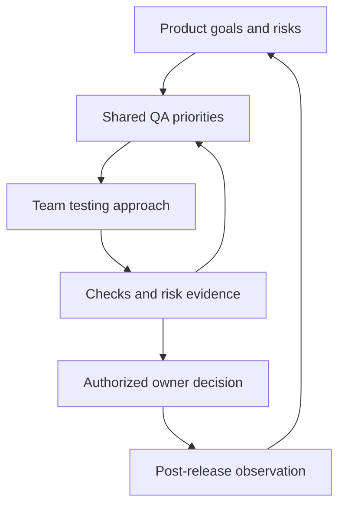

# Lead QA and Head of QA — Responsibilities, Metrics and Growth

## Main idea

A Lead QA typically organizes testing within a team or product, while a Head of QA develops the QA function across a broader scope. This is a useful scope model, not a universal job hierarchy. Check actual authority, team count, budget and expected outcomes.

Review of seven Russian images titled “Шпаргалка для QA-специалиста — Lead QA vs Head of QA”. All seven were read; the author and original URL are unknown. The “2024–2025” label does not establish a publication date, and the ISTQB badge does not establish provenance or endorsement. This is an independent analysis originally authored in Russian; English reference sources were used to verify individual concepts.

## Comparison across nine dimensions

| Dimension | Lead QA: typical focus | Head of QA: typical focus |
| --- | --- | --- |
| Responsibility | Testing within a team, project or product | Developing the QA function across teams or a business unit |
| Planning | Release, iteration and quarterly improvements | Cross-team priorities and long-term capabilities |
| People | Mentoring, coordination; sometimes line management | Team leaders, hiring and skills development, subject to authority |
| Technology | Test design, reviews and automation reliability | Agreeing shared principles with Engineering and technical specialists |
| Communication | Developers, Product and adjacent teams | Leadership, Product, Engineering, finance and other functions |
| Budget | Estimating needs; may have a spending allowance | Planning and justifying investments; approval may sit above the role |
| Metrics | Release risks and feedback effectiveness | User impact and sustainability of the QA function |
| Strategy | Designs the product approach and influences overall strategy | Aligns the function's strategy with business goals |
| Influence | Team or workstream; may run shared initiatives | Multiple products, a business unit or the organization |

QA Lead, Test Lead, QA Manager, Head, Director and VP are not automatically interchangeable titles. Clarify technical leadership separately from line management. Product quality is a shared responsibility, not exclusively a QA obligation.

## Daily work and outcomes

**Lead QA:** requirements and risk analysis, test and bug-report reviews, estimating testing effort, supporting automation, mentoring and coordination. Useful outcomes include a risk map, a verification plan, a clear residual-risk report and eliminated causes of flaky tests. Leads can delegate test execution; there is no mandatory percentage of hands-on coding time.

**Head of QA:** aligning priorities across teams, a competency model, people development, budget justification, shared quality approaches and evaluating improvements. Useful outcomes include agreed decision owners, an improvement portfolio, transparent costs and a connection between quality and user impact. The supplied set has no separate page of daily Head tasks; this paragraph is editorial synthesis, not a summary of a missing page.

The [ISTQB CTAL-TM overview](https://istqb.org/certifications/certified-tester-advanced-level-test-management-ctal-tm-v3-0/) addresses organizational strategy, the project approach and team management. Therefore, “Lead only executes; Head only creates strategy” is too rigid. The overview does not map corporate job titles.

## Metrics without misleading KPIs

The following table contains recommendations from this review. Each metric needs a period, denominator, data source and a decision it supports. Do not rank employees by the number of bugs they find.

| Metric in the images | How to use it and what to clarify |
| --- | --- |
| Defect density | Agree on the size unit and severity; different products and detection methods are not directly comparable |
| Test coverage | Name the object: risks, requirements, code or scenarios; a test case's existence does not prove execution or effective checking |
| Regression time | Separate elapsed time from effort; assess speed together with residual risk |
| Automation percentage | Define the eligible check set; include maintenance, flakiness and feedback speed |
| Post-release defects | Record severity, impact and observation window; counts depend on traffic and detection |
| Plan completion | Clarify the current plan and blocked checks; 100% completion does not imply acceptable risk |
| Quality OKRs | A framework for objectives and measurable results, not a single metric; connect to user outcomes |
| Cost of Quality | Include prevention, appraisal, internal and external failures; do not restrict it to bug fixing |
| Incident SLA | Clarify the promise and consequences of breach; distinguish an agreement from an internal target and recovery time |
| Growth and retention | Consider turnover, skill development and feedback together; eNPS alone does not measure competence |
| Time to Market | A joint result of Product, Engineering and other functions; separate waiting from useful testing |
| Process maturity | Needs a model, version, scope and assessment; a TMMi/CMMI label or level does not guarantee product quality |

[ASQ](https://asq.org/quality-resources/cost-of-quality) distinguishes four Cost of Quality categories. In a software example, training prevents problems, testing appraises quality, pre-release rework is an internal failure cost, and support caused by a post-release defect is an external failure cost. This is broader than QA-team spending.

[Google SRE](https://sre.google/sre-book/service-level-objectives/) distinguishes an SLI (a measured indicator), an SLO (a target) and an SLA (an agreement with consequences for breach). Response time may be part of an SLA, but not every internal target is an SLA. Agree on service restoration and risk acceptance ownership with the service owner and incident-response participants.

## Decision ownership example

Learning scenario: duplicate charges are discovered before releasing payment changes. This illustrates application; it is not a completed test result.

| Participant | Action and outcome |
| --- | --- |
| Lead QA | Checks reproducibility, risk scope and fix verification; prepares a release recommendation |
| Head of QA | Helps resolve cross-team constraints and allocate resources; checks whether shared prevention is needed |
| Engineering and service owner | Fix the cause and organize observability, recovery and technical rollback |
| Authorized release / business owner | Decides under previously agreed rules and records accepted risk |

A Head does not have to personally approve every release, and a Lead does not gain blocking authority from the title alone. The team's working agreement defines these powers.

## Career and company size

The images show Engineer → Senior → Lead → Manager → Head/VP with 0–2, 2–4, 3–6, 5–8 and 8+ years of experience. This is an unsupported illustration, not promotion criteria. Assess autonomy, problem complexity, developing others and demonstrated scope of influence. A technical path through expert roles without people management is possible; titles and transitions vary by company. The “you are here” label does not describe the reader's career.

The “under 50 / 50–300 / 300+ employees” scheme is not a standard either. A small company may combine roles; a large one may distribute QA across product teams without a dedicated Head. “Startups have no QA Manager” and “enterprises always have separate roles” cannot be used as rules. Look at product count, risks, regulation, maturity and team structure.

## Corrections to the source

- Strategy versus tactics remains a scope guide, not a prohibition on leads creating strategy.
- “Full budget responsibility” is replaced with checking actual authority and approval arrangements.
- The 60% tasks / 30% communication / 10% mentoring split is not accepted as a norm: the images provide no supporting research or basis.
- Career timelines and company headcount are not used as criteria for seniority or a mandatory set of positions.
- Cost of Quality, coverage, SLA and KPI limitations are clarified; TMMi/CMMI are not treated as interchangeable scales. Their complete models were not studied in this review.
- Head, Director and VP are not equated; the ISTQB badge is not presented as validation of the infographic.

## Role discussion checklist

- [ ] Which products, teams and risks are within scope?
- [ ] Which decisions do I make independently, and which need agreement with whom?
- [ ] Are there direct reports, hiring, performance reviews and budget powers?
- [ ] What outcomes are expected in the first 90 days, and what evidence will verify them?
- [ ] Who decides on release and accepts residual business risk?
- [ ] Which technical and management skills are needed for the next step?

## Related material and sources

- [Test planning](test-planning.md).
- [Release coordination](release-orchestration.md).
- [Measurable quality criteria](../fundamentals/software-quality-criteria.md).
- [Test-plan template](../../playbooks/templates/test-plan.md).
- [Register of the seven source images](../../docs/sources/2026-09-16-qa-lead-head-infographics.md): Russian source, page titles and SHA-256; original URL, author and license unknown.
- Verification sources above are English ISTQB, ASQ and Google SRE pages viewed on 2026-09-16. No claim is made that the complete ISTQB syllabus was read.
