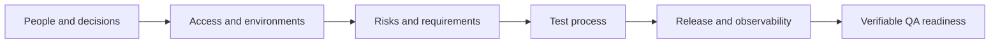

# QA Onboarding: Reviewed First-Days Checklist

## TL;DR

The single-page infographic offers 17 questions for joining a QA project: team and workflow, documentation and environments, communication and delivery, infrastructure, test artifacts, licensing and metrics. It is a useful conversation map, but “complete onboarding in 48 hours” should be treated as a goal for initial access and orientation, rather than a guarantee of full readiness.

The PDF was reviewed visually in full. It is one horizontal Russian page authored by Evgeniy Gusinets and branded with the QA4Life Telegram channel. It gives no publication date, source URL or license. The supplied written description matches the page structure; item 12 on the page also mentions hotfix and rollback, beyond the five illustrated stages.

## Onboarding outcome

Onboarding is complete when QA can independently take a change, find its requirement, prepare data, test it in an authorized environment, report a defect, explain risk and participate in a release decision.

## Reviewed checklist

### 1. People and process

- [ ] Identify product, technical, QA and release owners, plus the people accepting residual risk.
- [ ] Record who is responsible, accountable, consulted and informed for decisions and escalation.
- [ ] Obtain least-privilege task-tracker access; learn issue types, statuses, Definition of Ready/Done and priorities.
- [ ] Clarify time tracking only where the organization actually requires it.
- [ ] Move one real issue through the workflow and learn return, blocked, hotfix and cancellation paths.

### 2. Requirements and environments

- [ ] Locate current requirements, decisions and API contracts, and identify the owner of every source of truth.
- [ ] For Dev/Stage/UAT/Prod, record purpose, version, configuration, data, delivery mechanism and access limits.
- [ ] Clarify performance, reliability, security, accessibility, compatibility and observability requirements.
- [ ] Know current goals, dates, dependencies and release criteria.
- [ ] Record requirement gaps and questions that cannot safely be resolved by assumption.

### 3. Communication and release

- [ ] Learn required meetings, asynchronous channels, status format and incident response expectations.
- [ ] Do not let API/UI/mobile/backend ownership hide shared responsibility for complete user journeys.
- [ ] For a demo, know the audience, purpose, data, scenario, owner and fallback.
- [ ] Release flow covers trigger, approvals, migrations, feature flags, rollback, monitoring and post-release ownership.
- [ ] Use code freeze and demo only when they belong to the actual process; they are not universal release stages.

### 4. Infrastructure and testing

- [ ] Access follows least privilege; secrets are not pasted into broadly visible issues or documents.
- [ ] Know owners and request paths for VPN, logs, CI/CD, feature flags, observability and test data.
- [ ] Find current suites, run history, review rules and traceability in the TMS or repository.
- [ ] Choose the appropriate artifact: charter, checklist, test case or automated check.
- [ ] Record exact SPDX identifiers and component versions; engineering/legal/OSPO decide compatibility and QA verifies the agreed control.
- [ ] Every metric has a definition, source, owner, period and intended decision; no single number evaluates quality or a person.

## Corrections to the 17 points

| On the sheet | Practical clarification |
| --- | --- |
| “Check everything in the first 48 hours” | Two days can establish a project map and critical access; domain learning and independent delivery need evidence-based milestones |
| IPs, VPN, servers and logins | Request minimum roles through an approved channel; direct Production access is not a default QA requirement |
| Dev → Stage → UAT → Production | Names and counts vary; purpose, configuration, data and promotion path matter more |
| API/UI/mobile/backend as hard boundaries | Component owners help, but critical journeys require joint checks across boundaries |
| Freeze → Testing → Demo → Deploy → Monitoring | This is one possible flow. Continuous delivery, feature flags and progressive delivery may have no global freeze or pre-release demo |
| MIT/GPL/Apache | A family name is insufficient: exact version, exceptions, distribution and policy matter; SPDX identifies licenses but provides no legal interpretation |
| Bug density 2.3 bugs/KLOC is “positive” | Without defect definition, language, discovery phase and context, it cannot be interpreted; a decrease may also mean poorer detection |
| Test coverage 67% is “normal” | Coverage type and risk are missing. High coverage does not prove assertion quality or scenario value |
| Velocity 45 is “growth” | Velocity supports team planning; it is not productivity and should not be compared across teams |

## Readiness evidence

| Stage | Observable outcome |
| --- | --- |
| Access | QA can open an issue, documentation, test environment, logs and pipeline with an approved role |
| Understanding | QA can map a change from requirement to Production and name decision owners |
| Practice | QA independently checks a small change, saves evidence and reports a reproducible defect |
| Release | QA can explain release criteria, rollback, monitoring signals and residual risk |
| Feedback | Onboarding gaps are sent to owners and converted into documentation or access tasks |

## Sources and connections

- “QA ONBOARDING CHECKLIST: What to learn when joining a project,” one-page Russian PDF by Evgeniy Gusinets, received 2026-09-22.
- [SPDX handling license information](https://spdx.dev/learn/handling-license-info/) and [SPDX overview](https://spdx.dev/about/overview/).
- [Atlassian on sprint velocity](https://www.atlassian.com/agile/project-management/velocity-scrum) and [DORA delivery metrics](https://dora.dev/guides/dora-metrics/).

Connections: [release preparation and delivery](release-readiness-playbook.md), [risk-based test planning](test-planning.md), and [Lead QA vs Head of QA](lead-qa-vs-head-of-qa.md).
