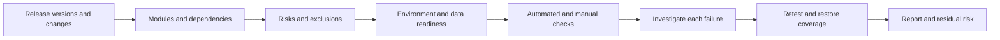

# Regression: Scope, Execution and Failure Triage

Regression checks whether a change damaged previously working behavior. Confirmation testing checks a specific fix. Plan both; a successful retest does not establish absence of side effects.

## From change to decision



## What belongs in the plan

| Risk source | Add beyond changed files |
| --- | --- |
| Direct changes | Modules, owners, affected scenarios and contracts |
| Indirect dependencies | Calling services, A → B → C chains, shared-library consumers |
| Migrations | Data transformation, version compatibility, verified recovery path |
| Flags | Available states and switching in a running system |
| Cache and CDN | Cold/warm state and invalidation |
| Queues and webhooks | Delivery, delays, retries, DLQ, consumer compatibility |
| Indexes and background work | Replica lag, search, schedules and convergence |
| Configuration and infrastructure | Timeouts, limits, dependencies, permissions, external settings |
| Delivery boundaries | Actual versions accounting for cherry-picks, reverts and deployment contents |

Start with actual versions rather than arbitrary branch names. These examples use illustrative tags whose existence must be checked in your repository:

```sh
git diff --name-only v1.2.3..v1.2.4
git diff --stat v1.2.3..v1.2.4
git log --oneline v1.2.3..v1.2.4
```

Diff identifies file changes, not the entire risk surface. Prioritize likelihood and consequence; numeric scales need agreed meanings. Record exclusions, reasons and the risk accepter. Test migrations with approved anonymized or synthetic data retaining realistic properties; schema rollback is not always possible and is not equivalent to data recovery.

## Readiness and depth

- Entry: build and configuration agreed, data/dependencies available, environment passed basic readiness checks.
- Depth: fast operability checks, critical end-to-end paths, then a broader risk-based set. Timing is project-specific; no universal minutes or hours apply.
- Automation checks known expectations; manual and exploratory sessions address gaps and new risks.
- Frequent small sets give fast feedback; broad-run schedules depend on cost and risk. Running the full suite does not itself create flakiness.
- Exit: plan completed or exclusions recorded; failures investigated, fixes retested, open risks have a decision owner.

Product changes, fixes, migration, retirement, dependencies and settings trigger scope reassessment. They do not all require the same suite.

## Selection and reporting commands

Register pytest markers in configuration and apply them to tests. Commands illustrate a configured project; they were not executed in Lab.

```sh
pytest -m "regression and not quarantine" --junitxml=report.xml
pytest -m quarantine
pytest --lf
npx playwright test --grep @regression
npx playwright test --last-failed
npx playwright test --grep @regression --shard=1/4
```

`--lf` and `--last-failed` use previous-run history, do not cover the entire release and need preserved state. For four shards, execute all four and combine outcomes. Parallel tests need independent data. Change-based selection can miss dynamic relationships: check its scope and supplement risky paths.

## Failure investigation

| Step | Check | Outcome |
| --- | --- | --- |
| Preserve signal | First attempt, build, environment, data, logs, trace | Original evidence not overwritten by retries |
| Reproduce | Same conditions; then controlled single-factor changes | Reproduction conditions or explicit uncertainty |
| Classify | Contract, product, test, data and infrastructure | Cause or hypothesis with an owner |
| Localize | Version comparison; bisect with a stable criterion | Confirmed relationship to a change |
| Fix and verify | Original scenario plus side-effect risks | Retest, outcome and restored coverage |

Three reruns do not prove a flaky test: the product defect may be intermittent. Quarantine means losing a reliable signal, so assign an owner, deadline, separate run and critical-risk compensation. Bound retries by policy and preserve all attempts. Playwright's `--fail-on-flaky-tests` can fail such a run; check support in your version.

Bisect needs a reproducible good/bad criterion and testable intermediate commits. It finds an observed behavior boundary, not automatically a root cause; finish with `git bisect reset`.

## Module record and review

Keep boundaries, dependencies, critical scenarios, data sources/restrictions, integration expectations, known defects and related changes. Update alongside behavior changes. Remove obsolete checks, merge actual duplicates and retain distinct risks. Track run duration, instability, investigation effort and escaped defects; pass rate without scope and exclusions says little about quality.

## Related material

- [One quality loop for manual and automated testing](manual-automation-quality-loop.md)
- [Release readiness](release-readiness-playbook.md)

## Sources

- [Evgeny Gusinets / QA❤️4Life: «Чек-лист регрессионного тестирования. Часть 1: что брать в регресс» (RU)](https://telegra.ph/CHek-list-regressionnogo-testirovaniya-CHast-1-chto-brat-v-regress-09-28)
- [Same author: «Часть 2: как прогнать и разобрать падения» (RU)](https://telegra.ph/CHek-list-regressionnogo-testirovaniya-CHast-2-kak-prognat-i-razobrat-padeniya-09-28)
- [pytest markers (EN)](https://docs.pytest.org/en/stable/how-to/mark.html)
- [Playwright CLI (EN)](https://playwright.dev/docs/test-cli)

Both articles read in full through the public Telegraph API; referenced books and syllabus were not separately read. Tables and examples are a practical adaptation rather than a copy of the originals.
