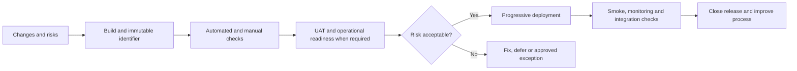

# Release Preparation and Delivery Playbook

## Release-readiness working model

For each release, record a specific build or commit SHA, change scope, dependencies, migrations, test results, unresolved defects, rollback plan, monitoring signals and decision owner. The same artifact should be tested and promoted to production; rebuilding after approval creates new uncertainty.

## Practical principles

- Definition of Ready is a common team agreement, but not an official Scrum commitment. The Scrum Guide says items gain sufficient readiness through refinement
- DoD describes the state of the Increment and required quality measures. It neither guarantees zero technical debt nor grants release approval by itself
- Quality is shared responsibility. QA supplies risk information; CI, branch rules, reviews and access controls should enforce technical constraints
- This is one viable workflow. Trunk-based development, feature flags, short-lived branches and continuous delivery stabilize changes differently
- SemVer communicates changes to a declared public API. An internal application may use another scheme if it unambiguously connects build, code and environment
- Status alone does not decide release readiness. Consider criticality, covered risk, reason, workaround, exception owner and residual impact
- Acceptance depends on contract and process. It may include user, operational, contractual or regulatory confirmation and need not be the only final stage
- The observation period follows traffic shape, delayed jobs, caches, integrations and SLOs. Some failures require a day or a full business cycle to surface
- Reproducibility, minimal diff, verification, approval, observability and propagation to all supported branches matter more than branch names

## Release criteria as evidence

| Area | Minimum evidence |
| --- | --- |
| Identity | Version, commit SHA, checksum or image digest; component list |
| Changes | Linked work items, release notes, migrations, feature flags and configuration |
| Quality | Required-check results, known defects, omissions and rationale |
| Data | Verified migration, backup or another demonstrated recovery mechanism |
| Operations | Dashboards, alerts, logs, response owners and rollback thresholds |
| Business | Required approvals, support, communications and launch timing |
| Decision | Who approved release, when, from which evidence and with what residual risk |

## Practical principles

- The final slide states 150 test cases, but the statuses total 142 passed + 5 failed + 1 blocked + 0 skipped = 148. Two cases have no status. The report is incomplete until its denominator is reconciled.
- The regression donut chart is illustrative. Percentages and absolute counts should come from the same data snapshot to keep the visualization consistent with the report.
- “Production configuration differs” is correctly identified as a threat, but documentation alone is insufficient: version, compare and automatically validate configuration before deployment.
- A rollback plan does not prove rollback is possible. Irreversible data migrations need a separate roll-forward or recovery strategy and rehearsal.

## Release checklist

- [ ] The release version and immutable artifact are identified.
- [ ] Changes, dependencies, migrations and feature flags are known.
- [ ] Required checks are complete; deviations have an owner and risk assessment.
- [ ] The environment and configuration are production-like or their differences were explicitly tested.
- [ ] Deployment, stop, rollback or recovery procedures are executable and verified.
- [ ] Dashboards, alerts, logs and business signals are ready before deployment.
- [ ] Decision owner, deployer and incident responders are assigned.
- [ ] Smoke scenarios, integrations and selected metrics are checked after deployment.
- [ ] The final report includes denominators, omissions, known issues and a recommendation.

## Sources

- [Source PDF — “QA Release Playbook”](../../docs/sources/originals/2026-09-21-qa-release-playbook.pdf), SHA-256 `faacf54d819a9db558c4ef4b584b05fac9839b2f0dfe61ee2c4556e3851c146d`.
- [Automating release coordination](release-orchestration.md).
- [Risk-based test planning](test-planning.md).
- [Test plan template](../../playbooks/templates/test-plan.md).
- [Scrum Guide 2020](https://scrumguides.org/docs/scrumguide/v2020/2020-Scrum-Guide-US.pdf), [Semantic Versioning 2.0.0](https://semver.org/) and [GitHub flow](https://docs.github.com/en/get-started/using-github/github-flow), checked 2026-09-21.
