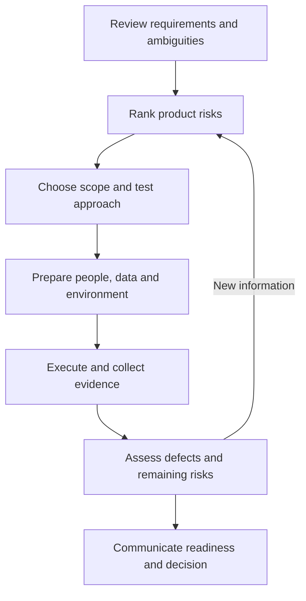

# Risk-Based Test Planning

## TL;DR

A useful plan connects product risks to coverage, people, environments, evidence, and a release decision. Keep it proportional to the change.

## Workflow

## Planning decisions

| Decision | Record |
| --- | --- |
| Scope | In-scope and excluded behavior, rationale |
| Test design | Happy paths, optional values, invalid input, valid input in disallowed states |
| Quality risks | Functional, performance, security and other relevant risks |
| Resources | Owners, skills, tools, environment, data and dependencies |
| Schedule | Milestones, estimates, constraints and progress reporting |
| Entry | Conditions needed to start useful testing |
| Suspension/resumption | When testing pauses and what allows it to restart |
| Exit | Evidence and residual-risk criteria used to conclude testing |
| Reporting | Coverage, defects, blocked checks and decisions |

## Practical example and ownership

For a saved-payment-method release, prioritize wrong-account access and incorrect selection before cosmetic issues. Record environment differences that weaken evidence. This is an original planning example.

QA coordinates test evidence; developers own implementation fixes; platform teams support relevant infrastructure; product and engineering decision-makers agree business priorities and release risk. Adapt ownership explicitly to the team.

## Limitations and source review

The source mixes entry/exit criteria with suspension criteria; keep them separate. Rate limiting alone does not establish denial-of-service resilience, and hiding data is not equivalent to encryption. High-load experiments need agreed scope and stop conditions. Review the plan with relevant decision-makers rather than assuming every stakeholder must approve every update.

## Related topics and sources

- [Test plan template](../../playbooks/templates/test-plan.md)
- [Testing concepts](../fundamentals/testing-concepts.md)
- Source: `cheatlistplan.pdf`, pp. 1-3; [provenance](../../docs/sources/2026-09-05-testing-cheat-sheets.md).
