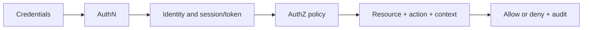

# Authentication and Authorization: Testing Access Without Confusion

## TL;DR

**Authentication (AuthN)** establishes or verifies a subject's identity. **Authorization (AuthZ)** decides whether that subject may perform an action on a particular resource. A successful login does not prove access control is correct: role, resource owner, tenant, scope, object state and server-side enforcement on every request all matter.

Evgeniy Gusinets' Russian article dated January 22, 2026 was read in full. It covers AuthN/AuthZ, stateful sessions, stateless tokens, the token lifecycle and API keys. Its beginner model is useful, but its rules for HTTP statuses, state and key security are too absolute.

## Test model

Do more than check whether a role can see a page. Call the API directly and alter the resource identifier, tenant, scope and method. A UI restriction is not an authorization control.

## HTTP without oversimplification

| Situation | Typical behavior | What to test |
| --- | --- | --- |
| Missing or invalid credentials | `401 Unauthorized` | An applicable `WWW-Authenticate` challenge is present for HTTP authentication; the client does not loop |
| Valid credentials but access refused | Usually `403 Forbidden` | The response does not expose unnecessary policy or foreign-resource details |
| Hide the existence of another user's resource | `404 Not Found` is allowed | Response differences and timing do not enable enumeration |
| Expired or not-yet-valid token | Contract-specific, often `401` | `exp`, `nbf`, clock skew and credential renewal are handled |
| Too many requests | Usually `429 Too Many Requests` | The limit binds to the correct subject and retry does not create a storm |

RFC 9110 defines `401` as a request lacking valid credentials for the target resource and requires `WWW-Authenticate`. `403` means the server understood the request but refuses to fulfill it; the reason can be unrelated to credentials. “401 means I do not know you; 403 means I know you but you may not enter” is a mnemonic, not the complete contract.

## Stateful, stateless and JWT

| Area | Stateful session | Self-contained token/JWT |
| --- | --- | --- |
| Primary state | Server record; client carries an opaque identifier | Claims are in the token; server verifies integrity and context |
| Scaling | Shared store or sticky strategy | Validation can be local, but keys, policy and revocation still require coordination |
| Logout/revocation | Invalidate server record and cookie | Short TTL, status/deny list, rotation or another threat-model control |
| Main tests | fixation, post-login rotation, idle/absolute timeout, concurrent sessions | signature/algorithm, `iss`, `aud`, `exp`, `nbf`, scopes/roles, replay, key rotation |

JWT is a claims format, not a complete authentication design. A signature protects integrity, while an ordinary signed JWT does not hide its payload. A “stateless” system often still reads keys, policy, user state, refresh sessions or revocation data.

## Credential lifecycle

- [ ] Issuance follows the required AuthN and grants minimum scopes.
- [ ] A token/session cannot be fixed before login or retained across a trust-level change.
- [ ] Signature/MAC, allowed algorithm, issuer, audience and time claims are verified.
- [ ] Expired, revoked, modified or wrong-audience tokens are rejected.
- [ ] Refresh tokens rotate and reuse of an old value is detected when required.
- [ ] Logout invalidates server state or meets the stated revocation model.
- [ ] Password changes, account blocks and role revocation affect active sessions as specified.
- [ ] Errors and logs contain no passwords, session IDs, API keys, access or refresh tokens.

## Authorization matrix

| Dimension | Positive check | Negative check |
| --- | --- | --- |
| Role/permission | Allowed action succeeds | Forbidden action is rejected by the server |
| Ownership | Owner reads/changes own object | User substitutes another object's ID |
| Tenant | Data stays inside the tenant | IDs, filters, exports and search do not cross tenants |
| Scope/audience | Token works at its target API | Token issued for another client/API is rejected |
| State | Valid transition succeeds | Closed/deleted/blocked object cannot be changed |
| Bulk operation | Every object is authorized | A partially forbidden set cannot bypass item-level checks |

## API keys

An API key commonly identifies an application or project rather than a person, although the contract can differ. A key is not automatically “insecure”: risk depends on entropy, TLS-only transport, scope, storage, rotation, lifetime, rate limits and leak detection.

- [ ] The key is absent from URLs, Referer, errors, analytics and ordinary logs.
- [ ] Headers and their values are redacted in every logging and tracing layer.
- [ ] Each environment/client has a minimally scoped key with a known owner.
- [ ] Revocation and rotation work without prolonged downtime.
- [ ] Missing, unknown, revoked and under-scoped keys differ only as much as the contract permits.
- [ ] Rate limits and quotas resist route, casing and concurrency bypasses.

## Sources and connections

- [Evgeniy Gusinets, “Аутентификация и Авторизация: не путаем понятия”](https://telegra.ph/Autentifikaciya-i-Avtorizaciya-ne-putaem-ponyatiya-01-22), Russian, published 2026-01-22 and read 2026-09-22.
- [RFC 9110: HTTP Semantics](https://www.rfc-editor.org/rfc/rfc9110.html), sections 15.5.2–15.5.4.
- [RFC 7519: JSON Web Token](https://www.rfc-editor.org/rfc/rfc7519.html).
- OWASP: [JWT Cheat Sheet](https://cheatsheetseries.owasp.org/cheatsheets/JSON_Web_Token_Cheat_Sheet.html), [Session Management](https://cheatsheetseries.owasp.org/cheatsheets/Session_Management_Cheat_Sheet.html), and [REST Security](https://cheatsheetseries.owasp.org/cheatsheets/REST_Security_Cheat_Sheet.html).

Connections: [REST API request basics](../api-testing/rest-api-request-basics.md), [HTTP status codes](../api-testing/http-status-codes.md), and [API testing tools and security](../../tools/developer-tools/api-testing-toolkit.md).
