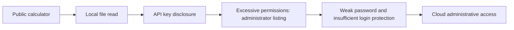

# File Reads and Cloud Access Boundaries

Arbitrary file reads become especially dangerous when an auxiliary service holds secrets granting access to more important systems.

## Risk chain

In Bastion's case, the service accepted absolute paths, ran with high privileges and exposed configuration. A discovered key permitted privileged API calls. IP-only throttling and missing second-factor protection did not prevent account compromise. This is the authors' pentest report, not an experiment reproduced in Lab.

## Test where the chain breaks — authored plan

Use an isolated environment, harmless marker files and test accounts.

| Boundary | Check | Expected evidence |
| --- | --- | --- |
| Report download | Allowed ID, unknown ID, another user's file | Only the authorized report; rejection reveals no path or contents |
| File system | Absolute path, directory escape, link outside the directory | Marker outside the allowed area is never returned |
| Process permissions | What the service can read after a path validation failure | Minimal privileges and isolation reduce exposure |
| Service credential | Allowed and administrative calls using a test key | Dedicated narrow scope; privileged call rejected |
| Administrator login | Repeated failures from different test sources | Protection accounts for identity and risk; attempts recorded |
| Recovery | Revoke a test secret and try it again | Old key stops working; replacement has intended restrictions |

Prefer server-side report identifiers with ownership checks. If paths are necessary, validate the resolved allowed path and links rather than only banning characters. A secret store helps manage credentials but does not make an overprivileged process safe: secret access still needs restrictions.

Do not equate file reading with code execution. Establish impact separately: which data is exposed and which actions the leaked identity permits. Evaluate login protection against product policy, including MFA and the risk of locking out legitimate users.

## Related material

- [Authentication and authorization](authentication-authorization-review.md)

## Source

- [bastion_pentest_team, Bastion: «Калькулятор с ключами: как чтение одного файла привело к компрометации публичного облака» (RU)](https://habr.com/ru/companies/bastion/articles/1083728/). Accessible article text reviewed; images were not analyzed separately.
