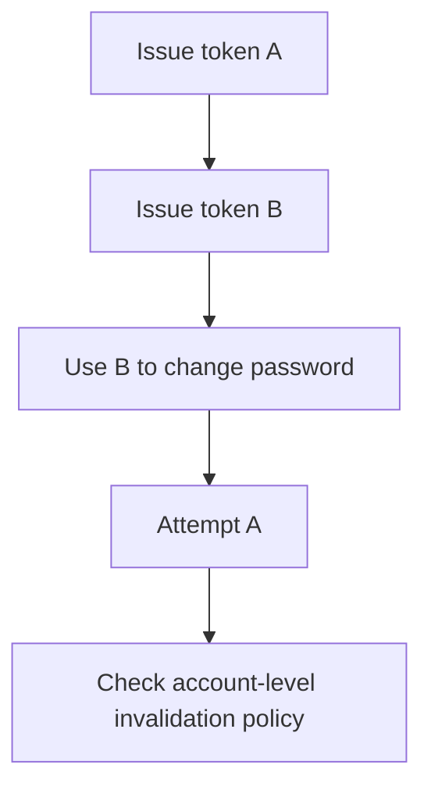

# Password Reset as a State Machine

## Summary

The article presents a scenario where reset links A and B are issued for one account. After B changes the password and becomes unusable, A still works. Each token passes an isolated single-use test, yet the account-level recovery lifecycle remains unsafe. This is a teaching scenario, not independently verified incident evidence.

## Test sequence

| Check | Expected evidence |
| --- | --- |
| A after B is issued | Behavior matches documented replacement policy |
| A after successful reset with B | No unintended remaining recovery route |
| B reused or expired | Rejected according to lifecycle rules |
| Existing sessions | Revoked or managed according to agreed policy |
| Parallel reset attempts | Consistent final state without unintended reuse |

The parallel-attempt check is an additional QA exercise proposed for this lab.

## Standards and limitations

OWASP recommends random, sufficiently long, securely stored, single-use expiring tokens, consistent account-discovery responses, abuse controls, reset notification and session invalidation or a choice to invalidate sessions. Its cheat sheet does not prescribe one universal rule that issuing B must immediately revoke A. An account-wide post-reset revocation policy is a security design decision to specify and test. [OWASP guidance](https://cheatsheetseries.owasp.org/cheatsheets/Forgot_Password_Cheat_Sheet.html)

## Related topics and source

- [Exploratory heuristics](../manual-testing/exploratory-heuristics.md)
- [API review](../../playbooks/checklists/api-request-review.md)
- [Password reset article](https://habr.com/ru/articles/1058180/). Full cached body read, including its OWASP qualification and promotional ending. No live account tests performed.
