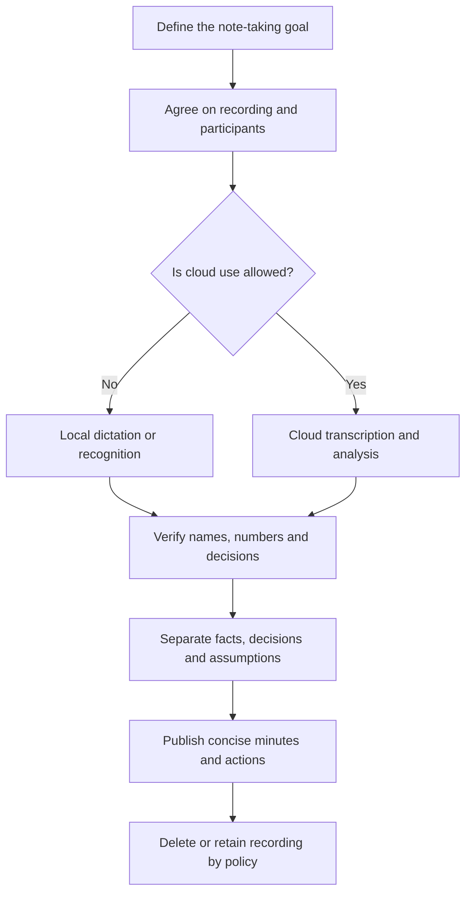

# Meeting Transcription for QA: Tool Choice and a Safe Workflow

## Selection map

| Task | Tool | Processing and key limitation |
| --- | --- | --- |
| Dictate directly into Jira, Confluence or a browser | [Handy](https://handy.computer/) | Recognizes on-device and inserts text into the active field; needs microphone and input permissions |
| Analyze an audio file once with a flexible prompt | [Google AI Studio](https://aistudio.google.com/) | Cloud multimodal model; data storage and use terms depend on account and tier |
| Meeting bot, transcript, summary and questions | [HypeScribe](https://www.hypescribe.com/ru) | Cloud service; the bot's participation is visible to others and plan limits apply |
| Source-grounded questions, instructions and onboarding | [NotebookLM](https://notebooklm.google.com/) | Cloud notebook grounded in uploaded sources; recognition errors flow into subsequent answers |
| Local file transcription on a Mac | [MacWhisper](https://www.macwhisper.net/) | Offers local and cloud modes; features and models differ between free and paid versions |
| Extract or transcode an audio track on Windows | [Format Factory](https://www.softportal.com/software-9536-format-factory.html) | Media preparation rather than transcription; verify installer provenance and encoding settings |

## What is confirmed and what was corrected

### Handy

The official [Handy documentation](https://handy.computer/docs) confirms Windows, macOS and Linux, a hotkey, local models and insertion into the active field. The app supports Whisper and other models, so “based on Whisper” is incomplete. According to its [privacy policy](https://handy.computer/privacy), ordinary recognition does not send audio or text to its maintainers, while networking is used for updates, model downloads and voluntarily configured services. History and recordings may be stored locally, without separate app-level encryption. “Data goes nowhere” is accurate only for normal local operation without external post-processing.

### Google AI Studio

[Gemini audio understanding](https://ai.google.dev/gemini-api/docs/audio) supports audio analysis, transcription, timestamps and questions about content. AI Studio suits prompt experiments, but it uploads the file to a cloud service. Before using a work recording, check current data terms for the account type, company regional rules and whether third-party AI is permitted. A summary should point to segments or timestamps; otherwise it can easily distort a decision.

### HypeScribe

The product page confirms a Note Taker for Zoom, Teams and Google Meet, questions about content, and links from YouTube, VK, Rutube and other platforms. According to the [current pricing page](https://www.hypescribe.com/pricing), the free trial is limited to three files per month up to one hour each; Meeting Notetaker is not available on every plan. The service says it deletes source audio after processing, while transcripts and account data are still processed in the cloud. Marketing claims about speed and accuracy were not independently tested.

### NotebookLM

Official [source help](https://support.google.com/gemininotebook/answer/16215270?hl=en) confirms local audio imports: upload creates a transcript that is stored as a source; Russian is supported. Video or link support depends on the format: for example, YouTube requires available captions. Cited answers help verification, but a citation points to a transcript that can itself be wrong.

### MacWhisper

The official site confirms a free version, local and cloud models, media-file and meeting support. Its [CLI documentation](https://docs.macwhisper.com/article/57-macwhisper-command-line-tool) confirms timestamped output. “No cloud” is true when a local model is selected; optional cloud models and AI features can transmit data. The claim that the free version has no file-size limit could not be confirmed on the official pages reviewed.

### Format Factory

Extracting mono audio at an appropriate bitrate usually reduces upload size. It does not shorten the recording and does not guarantee faster recognition after upload. Excessive compression can harm speech quality. The source link points to the SoftPortal catalog, not a verified developer page; check the publisher and digital signature before installation. FFmpeg from a trusted source also supports a repeatable workflow.

```text
ffmpeg -i meeting.mp4 -vn -ac 1 -ar 16000 -b:a 48k meeting-audio.m4a
```

## Safe QA workflow



1. Before the meeting, state the purpose of recording and obtain required consent. Account for contracts, local law and employer policy.
2. Do not upload source code, credentials, personal data, commercial terms or a client recording to a personal cloud account without authorization.
3. Keep the original until transcript review is complete, and record language, participants, time zone and date.
4. Verify names, issue numbers, versions, amounts, negations and statements that create a commitment.
5. Distinguish `decided`, `proposed`, `needs clarification` and `AI inferred`.
6. Move one verified action with an owner and due date into Jira rather than the entire raw transcript.

## Transcript prompt template

```text
Using only this transcript, produce:
1. confirmed decisions with timestamps;
2. actions: task, owner and due date; write “not stated” when missing;
3. open questions and contradictions;
4. testing risks and affected components;
5. terms and numbers that need verification against the audio.
Do not invent decisions or owners absent from the source.
```

## Pre-publication checklist

- [ ] Participants know about the recording and processing purpose.
- [ ] An allowed local or cloud mode was selected.
- [ ] Confidential data may be uploaded to the selected service.
- [ ] Decisions and actions were checked against audio or participants.
- [ ] Every action has a task, owner and due date, or the gap is explicit.
- [ ] Raw recordings and transcripts have an owner, retention period and deletion rules.

## Sources

- The source Russian collection with six links, supplied by the user on 2026-09-21; author and publication URL unknown.
- [Handy](https://handy.computer/), [Google AI Studio](https://aistudio.google.com/), [HypeScribe](https://www.hypescribe.com/ru), [NotebookLM](https://notebooklm.google.com/), [MacWhisper](https://www.macwhisper.net/), [Format Factory on SoftPortal](https://www.softportal.com/software-9536-format-factory.html).
- [Risk-based test planning](../../qa/qa-process/test-planning.md).
- [Test plan template](../../playbooks/templates/test-plan.md).
